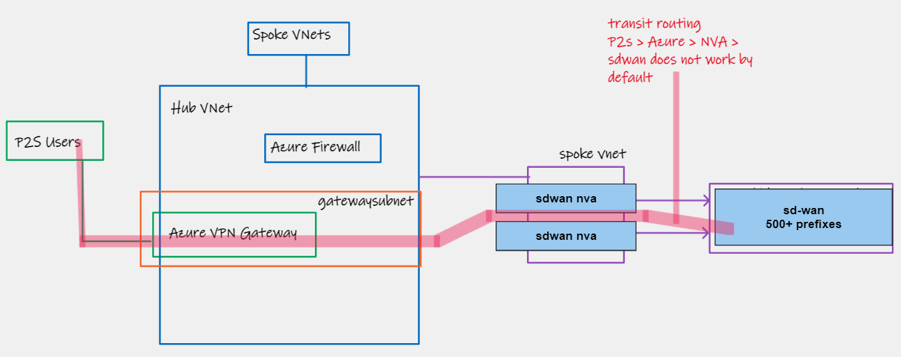
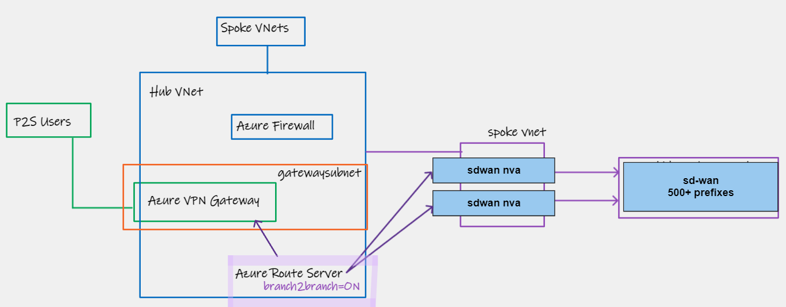
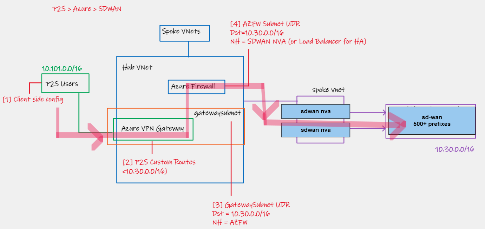
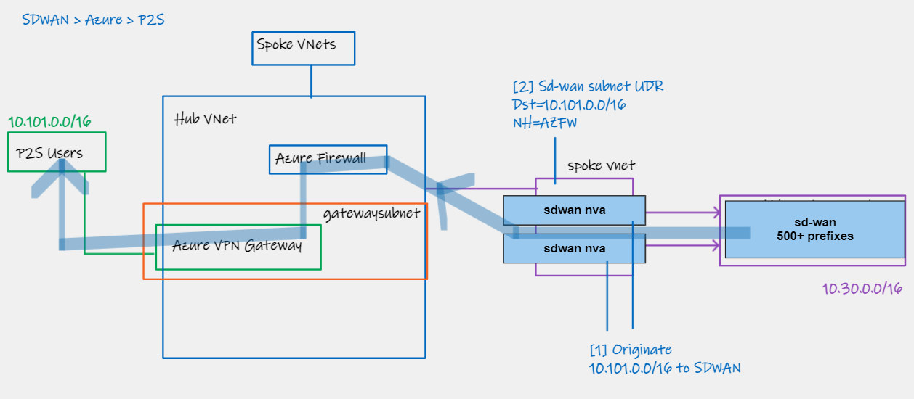
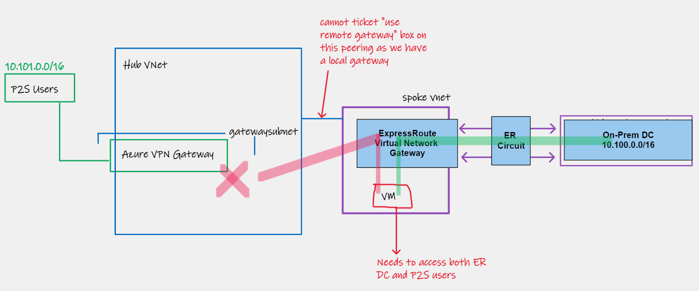
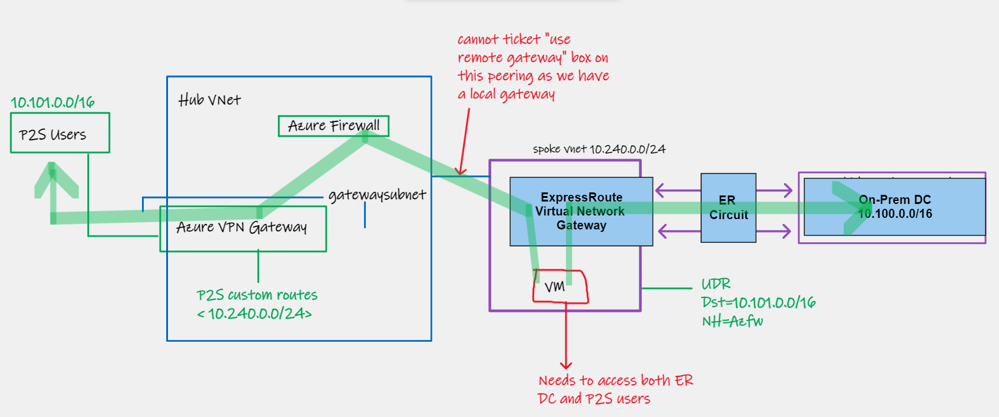

# VPN Gateway Custom Routes Feature

##  Introduction

An often forgotten and easily-missed feature of the Azure VPN Gateway (The standalone Azure Native VPN Service deployed in a custom-managed Virtual Network) is the ability to advertise any route specified by the user, to P2S Client VPN Users (even if that route does not exist in the local or peered VNet address spaces). This can lead to some interesting use cases and providers another tool for your belt in Azure Networking. Let's explore some use cases.

> Specifically here we are talking about P2S VPN, not S2S VPN. And we are talking about VPN Gateway, not Azure Virtual WAN.

The official documentation on VPN Gateway custom routes is [here](https://learn.microsoft.com/en-us/azure/vpn-gateway/vpn-gateway-p2s-advertise-custom-routes). 

## Use case 1 - Public IPs 

The use case within the official documentation linked above is advertising Azure Storage Public IPs over the VPN. This is rarely used today as Private Endpoints are a much better solution and work natively over a P2S connection assuming the DNS resolution is handled.

> Note this cannot be used for reaching non-Azure public IPs, I.e. you cannot perform centralised internet egress using custom-routes and 0/0 specification, this must be done using Secured Virtual Hub (Azure Firewall in Virtual WAN). Explained here https://youtu.be/UXZ6cm8z0Pc

## Use case 2 - Azure transit scenarios
  
### Context 

A semi common requirement is to terminate Client VPN users in Azure, and then provide onwards connectivity to networks _outside_ of Azure. These onwards networks could be connected by various methods including;

- S2S VPN to native Azure VPN Gateway
- ExpressRoute
- SDWAN via Network Virtualised Appliance

Typically the first patterns that spring to mind for addressing the above, are Azure Route Server[*] or [Virtual WAN](https://learn.microsoft.com/en-us/azure/virtual-wan/scenario-any-to-any). I want to highlight here that P2S Custom Routes also offer a third design option when addressing the SD-WAN to P2S user requirement.

> [*] Be careful, ARS does not support P2S transit [today](https://learn.microsoft.com/en-us/azure/route-server/route-server-faq#can-azure-route-server-provide-transit-between-expressroute-and-a-point-to-site-p2s-vpn-gateway-connection-if-the-branch-to-branch-setting-is-enabled)

### Problem statement

Take the following Azure Networking topology. 

Despite the P2S users being connected to a VPN Gateway in the Hub VNet, and our SD-WAN being connected to a Virtual Appliance in our Spoke VNet, these networks cannot communicate with each other via Azure as a transit network. Why?

- The VPN Gateway advertises only the Hub VNet and Spoke VNet (assuming the spoke has "Use Remote Gateway" ticked on the Peering connection) address ranges to my P2S users. Therefore my P2S users in a sense have no idea that my blue SD-WAN network exists.
- The SD-WAN network equally has no idea that my P2S user range exists

A common requirement is to also need firewalling within this transit network function, so lets also assume that we want to place an Azure Firewall between our P2S users and our SD-WAN network.

### Azure Route server complexity

Despite ARS not working for P2S to ER transit, we are able to use it for P2S to NVA route exchange, so could that be used to address our scenario?

The answer is yes, but depending on your environment it comes with some considerations, namely:

- Unless your SD-WAN NVA can summarise its routes, all prefixes will be shared with the VPN Gateway. This can be problematic, because when using IKEv2 as your protocol you have significant [route limit constraints](https://github.com/adstuart/azure-vpn-p2s/tree/main/misc-win10-ikev2-trafficselectors). 
- Unless your SD-WAN NVA can also act as a firewall, you have not solved your network filtering requirement, and to do so, will require UDR's that over-ride every single prefix from your NVA, which could be problematic again due to limits, specifically the 400 UDR entry limit present on Azure today

### Enter P2S custom routes

I want to state up front that I am not suggesting you should jump to statically defined configs such as this as the default transit pattern for P2S, rather that it is an option, and can be useful if you have prefix limit issues, lack of summarisation, and a fairly static and contiguous address space throughput your network.

The customer in question that deployed this solution recently met this criteria, and was happy to trade off the lack of dynamic routing, to benefit from a simple and inexpensive solution that allow summarisation through obscurity.

The following topology can be used to achieve the transit routing, along with Azure Firewall insertion:

**P2S > Azure > SDWAN**

- [1] Client side P2S config is either handled by default with OpenVPN, or if using IKEv2 as part of the `<route></route>` parameter field. I.e. this tells the client to put the traffic inside the P2S tunnel towards Azure if destined to the SD-WAN network
- [2] The core idea of this article, the P2S [Custom Routes](https://learn.microsoft.com/en-us/azure/vpn-gateway/vpn-gateway-p2s-advertise-custom-routes) feature is used to ensure the VPN Gateway advertises 10.30.0.0/16, our SD-WAN prefix, as part of the tunnel encryption domain
- [3] A UDR on the GatewaySubnet instructs the P2S Gateway to send traffic destined to 10.30.0.0/16 to the Azure Firewall
- [4] A UDR on the AzureFirewallSubnet instructs traffic destined to 10.30.0.0/16 to be sent to the SD-WAN NVA solution, either a single NVA, or LB for HA
- [5] Once the SD-WAN NVA receives this traffic, it inherently knows what to do with it, as part of its knowledge of the wider SD-WAN

**SDWAN > Azure > P2S**

- [1] The SD-WAN NVA originates a static route in to the SD-WAN network representing our P2S user pool 10.101.0.0/16, this grooms traffic for this range from the SD-WAN branches to the NVA in Azure
- [1a] Internal static routing in the SD-WAN O/S should drop this packet on the Azure SDN wire, normally handled by an internal default route
- [2] A UDR on the SD-WAN NVA subnet is configure to send traffic destined for our P2S range to Azure Firewall. (No need for gateway route propagation enablement on the UDR).
- [3] From here on, its standard Azure logic, AZFW gets the packet and knows that 10.101.0.0/16 exists via our VPN Gateway as its inside of the same VNet, and will have an internal route with Next-Hop "Virtual Network Gateway".
- [4] P2S Gateway forwards traffic to remote user via P2S Tunnel

## Use case 3 - Multiple Gateway egress

Sometimes we are faced with strange requirements that do not fit inside the regular mold of Azure Networking. Specifically the mold of hub/spoke and centralised networking services and gateways. Take the following example, wherein we have a spoke VNet with a local ExpressRoute Gateway, which also required access to centralised P2S user function.

The Virtual Machine "VM" inside of the Spoke VNet can access the On-Premises Data Centre via its "local" "in-VNet" ExpressRoute Virtual Network Gateway, but the P2S users within 10.101.0.0/16 cannot access the VM, as its not possible to tick "use remote gateway" on the peering from Spoke to Hub, due to the presence of the local gateway.

### Enter P2S Custom Routes

By configuring P2S Custom Routes on your Azure VPN Gateway, we are able to force it to "advertise" the spoke range, despite that same spoke not having "use remote gateway" ticket on the VNet peering connection. 

We then use Azure Firewall as an intermediate IP Forwarding device to get traffic from the Spoke VNet in to the Hub VNet. (NB. We cannot use Next-Hop Virtual Network Gateway on the Spoke UDR for the traffic, because it would interpret that logic as the local Gateway, not the Hub Gateway).

The result is we have a spoke Virtual Machine with reachability to two disparate networks, via two different Azure Virtual Network Gateways, something that is normally not possible with the Azure Hub/Spoke centralised model. Perhaps not something you need everyday, and not something you should run around pushing in to every design, but a good one to keep in the back pocket.

