# Azure VPN Client deployment via Intune

<!-- TOC -->

- [Azure VPN Client deployment via Intune](#azure-vpn-client-deployment-via-intune)
- [Context](#context)
- [Overview](#overview)
- [Considerations](#considerations)
- [Guide](#guide)
    - [1. Step 1 - Enable the Microsoft Store for Business](#1-a-namestep1-enablethemicrosoftstoreforbusinessastep-1---enable-the-microsoft-store-for-business)
    - [2. Step 2 - Initial Store settings](#2-a-namestep2-initialstoresettingsastep-2---initial-store-settings)
    - [3. Step 3 - Add Azure VPN Client app to your Store for Business](#3-a-namestep3-addazurevpnclientapptoyourstoreforbusinessastep-3---add-azure-vpn-client-app-to-your-store-for-business)
    - [4. Step 4 -Assign App to users and set availability](#4-a-namestep4-assignapptousersandsetavailabilityastep-4--assign-app-to-users-and-set-availability)
    - [5. Step 5 - Sync purchase apps from within Intune](#5-a-namestep5-syncpurchaseappsfromwithinintuneastep-5---sync-purchase-apps-from-within-intune)
    - [6. Step 6 - Back to InTune to verify](#6-a-namestep6-backtointunetoverifyastep-6---back-to-intune-to-verify)
    - [7. Step 7 - Assign app to user(s)](#7-a-namestep7-assignapptousersastep-7---assign-app-to-users)
    - [8. Step 8 - Verify Windows10 Client](#8-a-namestep8-verifywindows10clientastep-8---verify-windows10-client)
    - [9. Step 9 - Verify VPN Connectivity](#9-a-namestep9-verifyvpnconnectivityastep-9---verify-vpn-connectivity)
    - [10. Appendix A - Online vs Offline](#10-a-nameappendixa-onlinevsofflineaappendix-a---online-vs-offline)
- [Closing](#closing)

<!-- /TOC -->

#  Context

:warning: **Note.** Before continuing, be aware of future changes in respect to the Microsoft Store for business: https://techcommunity.microsoft.com/t5/windows-it-pro-blog/evolving-the-microsoft-store-for-business-and-education/ba-p/2569423

:no_entry: **Important!** If you are using Group Policy Objects (GPO), enabling the settting _Turn off Automatic Download and Install of updates_ prevents automatic updates from the Microsoft Store for Business, and therefore will prevent installation of Online-only (see Appendix A) apps such as the Azure VPN Client

The Azure VPN Client is a VPN plugin for Windows 10 that provides additional features including support for the OpenVPN transport protocol, and Azure AD authentication. See here for more context https://github.com/adstuart/azure-vpn-p2s/tree/main/intune-win10-triggers#big-picture. 

If you have found this document, you have probably already worked out how to push the VPN configuration itself via Intune to your clients, this is nicely covered in these articles below:

- https://docs.microsoft.com/en-us/azure/vpn-gateway/vpn-profile-intune
- https://docs.microsoft.com/en-us/azure/virtual-wan/vpn-profile-intune

However, installation of the Azure VPN Client itself, is another thing that needs consideration if managing endpoints via Intune. Yes, you can manually install the Azure VPN Client from the Windows Store (https://www.microsoft.com/en-us/p/azure-vpn-client/9np355qt2sqb?activetab=pivot:overviewtab), but you may wish to remove the task from your users to provide a better overall experience.

# Overview

This document is aimed at IT administrators who are managing the Intune estate and have been asked to provision the Azure VPN Client at scale to their clients, in order to support the wider Client P2S project.

This document provides a step-by-step guide showing how to achieve this without permitting open access to the public Microsoft Store. We start from the perspective of an Intune administrator who has never worked with the Microsoft Store for Business.

Consider this a soup-to-nuts guide, if you are already experienced in the early steps, feel free to skip ahead. If you are new to everything Intune, then read on!

# Considerations

The Azure VPN client is only available for installation via the Microsoft Store, there is no offline MSI available as of 2021 https://docs.microsoft.com/en-us/answers/questions/77709/why-there-is-dependency-on-microsoft-store-to-inst.html.

# Guide

##  1. Step 1 - Enable the Microsoft Store for Business

In order to push out the Azure VPN Client to your users, without requiring them to manually install via the public Microsoft store, we will use the Microsoft Store for Business. Enterprises very rarely want to permit their users open access to every application on the public store. Using the Store for Business we can provide a prescribed list of applications, approved by central IT, and also choose to push these to devices for automatic installation.

- Microsoft Endpoint Manager (endpoint.microsoft.com) (aka MEM) > Tenant Administration > Microsoft Store for Business > Enable toggle > Save

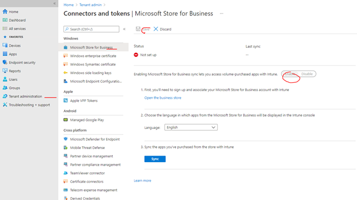

- Accept Store license agreement.

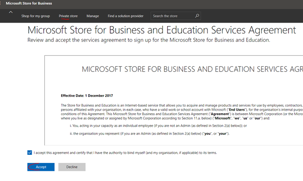

##  2. Step 2 - Initial Store settings

- Click the link inside of your current Intune view "Open the business store", this will take your to businessstore.microsoft.com.

- Manage > Settings > Shop > "Allow users to shop"

Set this to on if you wish to allow users to be able manually install from the selection of apps you provide, or set to off if you plan on purely pushing out apps in the background automatically.

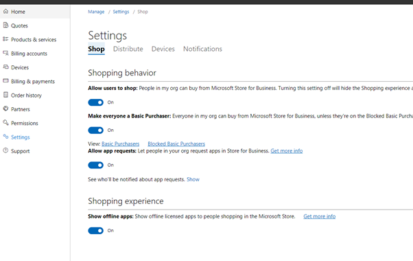

- Manage > Settings > Distribute > Change Store name to suit

- Manage > Settings > Distribute > Activate both "Intune" and "Intune enrollment"

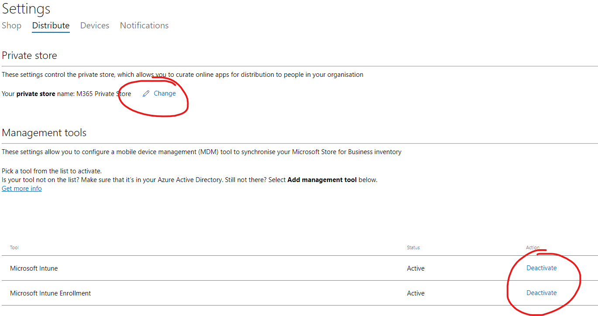

##  3. Step 3 - Add Azure VPN Client app to your Store for Business

- Under _Shop for my Group_, Search for the app by name, and click its logo.

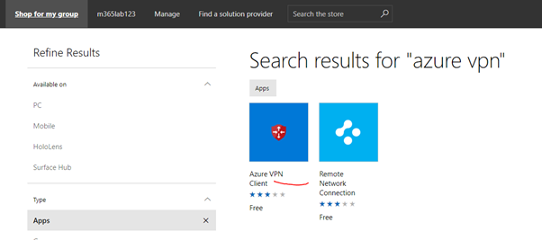

- Click "get the app"

- Now go to The Manage tab and choose "manage apps", you should see the Azure VPN Client in your list.

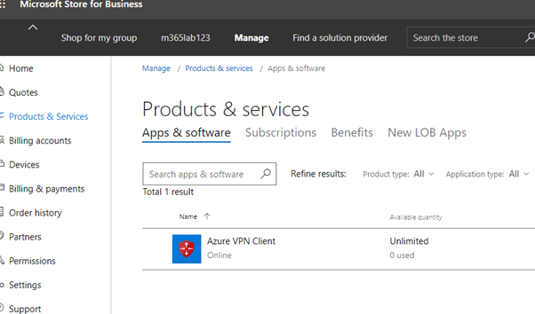

##  4. Step 4 -Assign App to users and set availability

- Assign to your chosen users

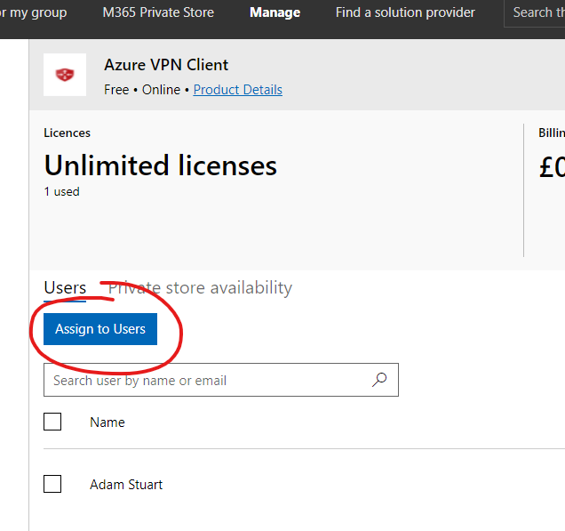

- Set visibility of the App

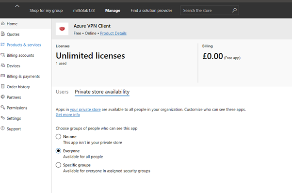

In my testing I simply used "everyone", but you may wish to be more specific, for example only allowing members of a "VPNusers" group to have access to the Azure VPN Client plugin.

##  5. Step 5 - Sync purchase apps from within Intune

- Back to Microsoft Endpoint Manager (endpoint.microsoft.com) (aka MEM) > Tenant Administration > Microsoft Store for Business > (3) Sync

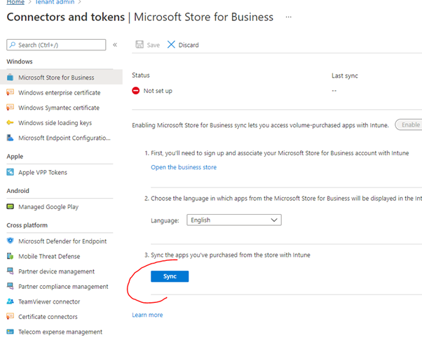

:warning: **Note.** This can take some time to complete (~hours).

##  6. Step 6 - Back to InTune to verify

- If everything above completed successfully then inside of MEM > Apps > Windows, you should now see your synced apps listed. Notice how they are, at this stage, unassigned.

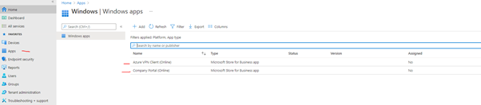

##  7. Step 7 - Assign app to user(s)

- MEM > Apps > Windows > Azure VPN Client (Online) > Properties

- Next to Assignments, choose Edit, allocate as per your organisations requirements. For testing you may choose to assign to "all devices", but most Enterprise customers are going to be using user based groups for allocation.

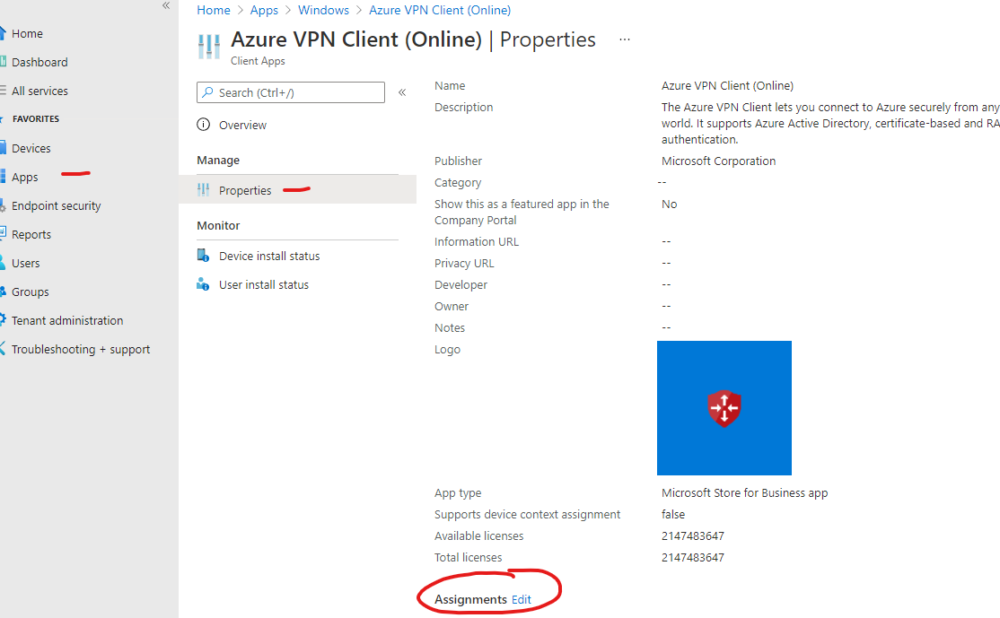

- Within assignments, you also have the high level choice of assignment type. Probably most folks reading this guide will want to choose "required", I.e. When a device syncs to Intune, the Azure VPN Client will be automatically installed as per company policy. Choosing "Available to enrolled devices" would make it a user driven action.

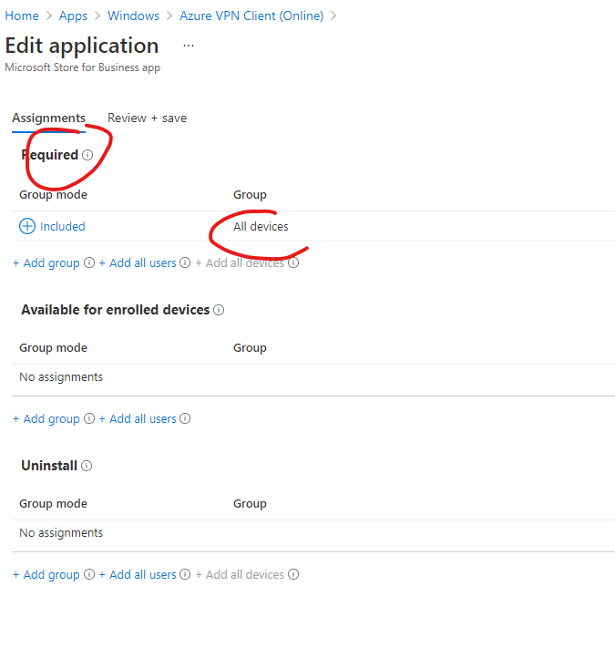

##  8. Step 8 - Verify Windows10 Client

- After 5-10mins, or after a forced device sync, we can verify the Azure VPN Client has been pushed to the user's device in two ways. Either open the MS Store, notice how we now have a private Microsoft Store for Business tab, within which you should see the app, and its installation status reflected correctly.

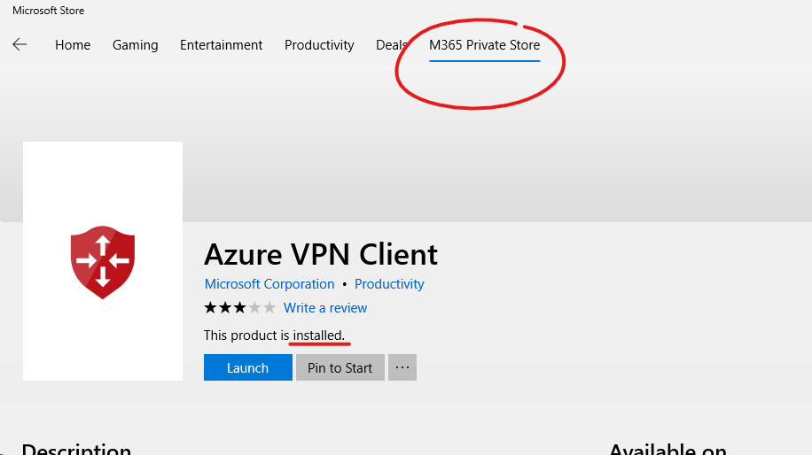

- Or We can also verify installation compliance from within Intune itself. This takes 15-30mins to update.

- MEM > Apps > Windows > Azure VPN Client > User Install Status > [username] 

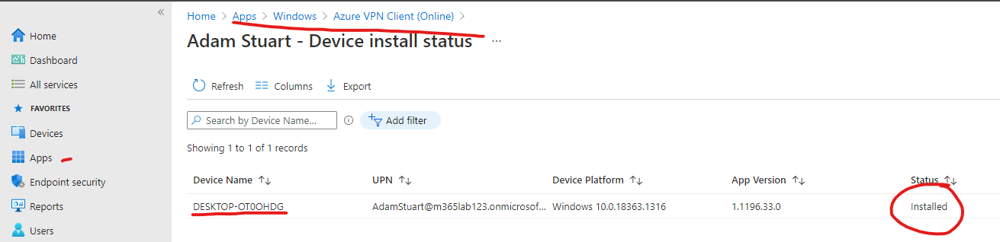

##  9. Step 9 - Verify VPN Connectivity

- With the Azure VPN Client plugin now installed, and assuming you have configured your authentication and completed the deployment of the VPN configuration profile (Again, see, https://docs.microsoft.com/en-us/azure/vpn-gateway/vpn-profile-intune / https://docs.microsoft.com/en-us/azure/virtual-wan/vpn-profile-intune) then your client should now have everything it needs to setup the P2S connection to Azure.

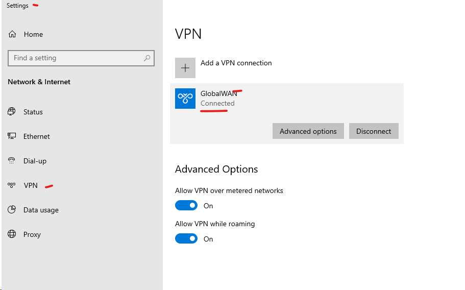

##  10. Appendix A - Online vs Offline

As stated at the start of this document, the Azure VPN Client is only available for installation via the Microsoft Store, this constraint manifests itself in the Store GUI in the following way.

- Lets first look at another app, the _Company Portal_ app, for example, notice in the store you can specify both an _Online_, and an _Offline_, versions of the app. Offline refers to a point in time installation, that will not update unless forced by you, the Intune administrator.

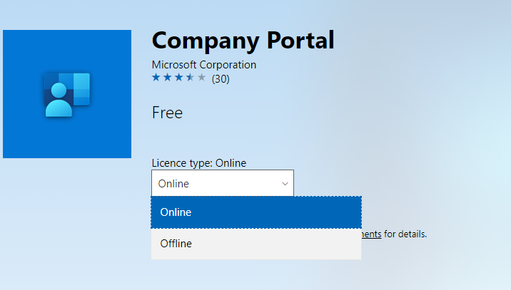

- Now look at the Azure VPN Client from the same view. Notice that the online vs offline toggle is not available. That is because the Azure VPN Client app is only an Online-only app, I.e. it can **only** be pushed from the store, and must remain in sync, I.e. automatically updated.

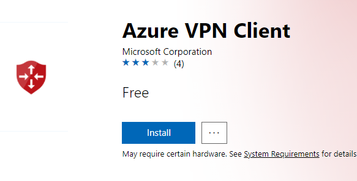

- You can also see the above attribute reflected in your Manage Apps view in the store.

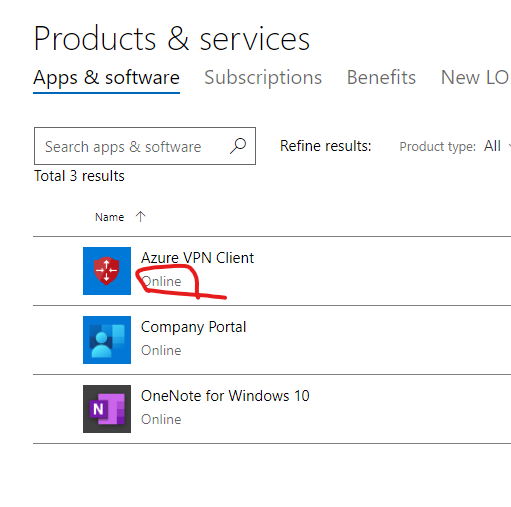

# Closing

Thanks to my fellow Microsoft colleagues for supporting this testing.
  
- Antonio Traetto
- Jack Tracey
