# Azure VPN Client deployment via Intune

#  Context

### :point_right: Note

> Before continuing, be aware of future changes in respect to the Microsoft Store for business: https://techcommunity.microsoft.com/t5/windows-it-pro-blog/evolving-the-microsoft-store-for-business-and-education/ba-p/2569423

The Azure VPN Client is a VPN plugin for Windows 10 that provides additional features including support for the OpenVPN transport protocol, and Azure AD authentication. See here for more context https://github.com/adstuart/azure-vpn-p2s/tree/main/intune-win10-triggers#big-picture. 

If you have found this document, you have probably already worked out how to push the VPN configuration itself via Intune to your clients, this is nicely covered in these articles below:

- https://docs.microsoft.com/en-us/azure/vpn-gateway/vpn-profile-intune
- https://docs.microsoft.com/en-us/azure/virtual-wan/vpn-profile-intune

However, installation of the Azure VPN Client itself, is another thing that needs consideration if managing endpoints via Intune. Yes, you can manually install the Azure VPN Client from the Windows Store (https://www.microsoft.com/en-us/p/azure-vpn-client/9np355qt2sqb?activetab=pivot:overviewtab), but you may wish to remove the task from your users to provide a better overall experience.

# Overview

This document is aimed at IT adminstrators who are managing the Intune estate and have been asked to provision the Azure VPN Client at scale to their clients, in order to support the wider Client P2S project.

This document provides a step-by-step guide showing how to achieve this without permitting open access to the public Microsoft Store. We start from the perspective of an Intune administrator who has never worked with the Microsoft Store for Business.

# Considerations

The Azure VPN client is only available for installation via the Microsoft Store, there is no offline MSI available as of 2021 https://docs.microsoft.com/en-us/answers/questions/77709/why-there-is-dependency-on-microsoft-store-to-inst.html.

# Step 1 - Enable the Microsoft Store for Business

In order to push out the Azure VPN Client to your users, without requiring them to manually install via the public Microsoft store, we will use the Microsoft Store for Business. Enterprises very rarely want to permit their users open access to every application on the public store. Using the Store for Business we can provide a perscribed list of applications, approved by central IT, and also choose to push these to devices for automatic installation.

Microsoft Endpoint Manager (endpoint.microsoft.com) (aka MEM) > Tenant Administration > Microsoft Store for Business > Enable toggle > Save

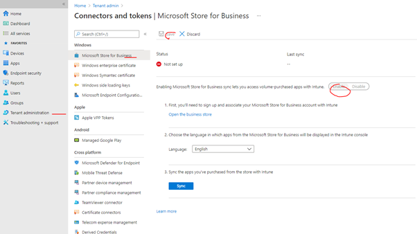

Accept Store license agreement.

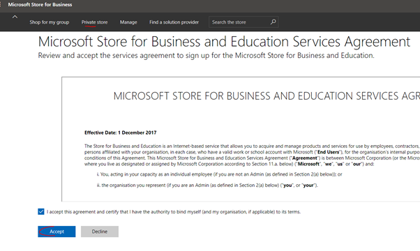

# Step 2 - Initial Store settings

- Click the link inside of your current Intune view "Open the business store", this will take your to businessstore.microsoft.com.

- Manage > Settings > Shop > "Allow users to shop"

Set this to on if you wish to allow users to be able manually install from the selection of apps you provide, or set to off if you plan on purely pushing out apps in the background automatically.

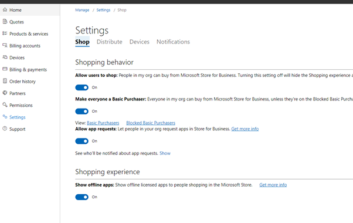

- Manage > Settings > Distribute > Change Store name to suit

- Manage > Settings > Distribute > Activate both "Intune" and "Intune enrollment"

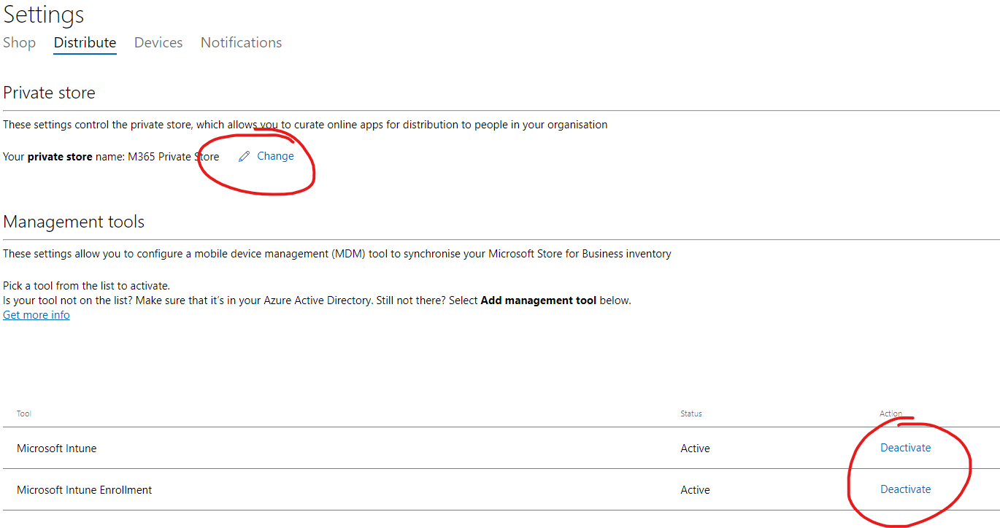

# Step 3 - Add Azure VPN Client app to your Store for Business

Under Shop for my Group, Search for the app by name, and click its logo.

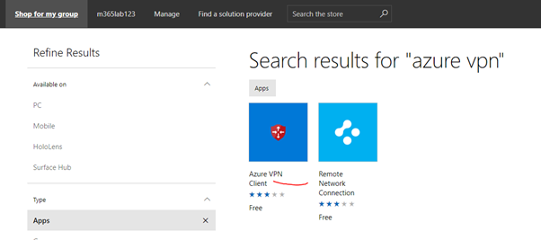

Click "get the app"

Now go to The Manage tab and choose "manage apps", you should see the Azure VPN Client in your list.

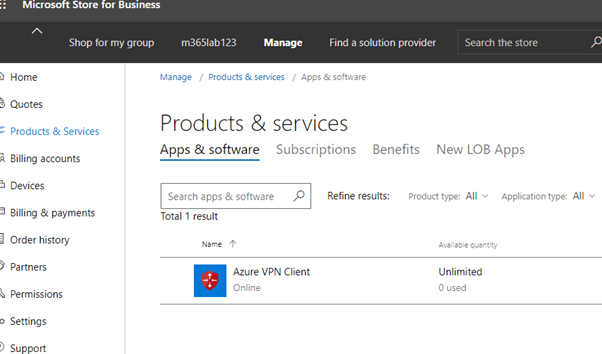

# Step 4 -Assign App to users and set availability

- Assign to your chosen users

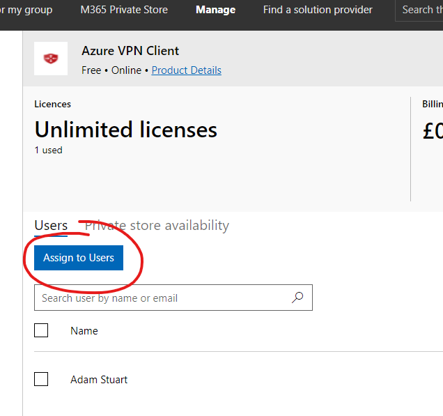

- Set visibility of the App

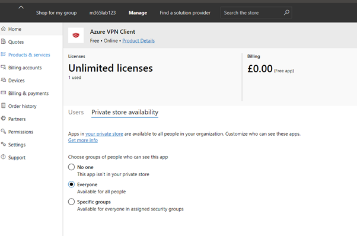

In my testing I simply used "everyone", but you may wish to be more specific, for example only allowing members of a "VPNusers" group to have access to the Azure VPN Client plugin.

# Step 5 - Sync purchase apps from within Intune

Back to Microsoft Endpoint Manager (endpoint.microsoft.com) (aka MEM) > Tenant Administration > Microsoft Store for Business > (3) Sync

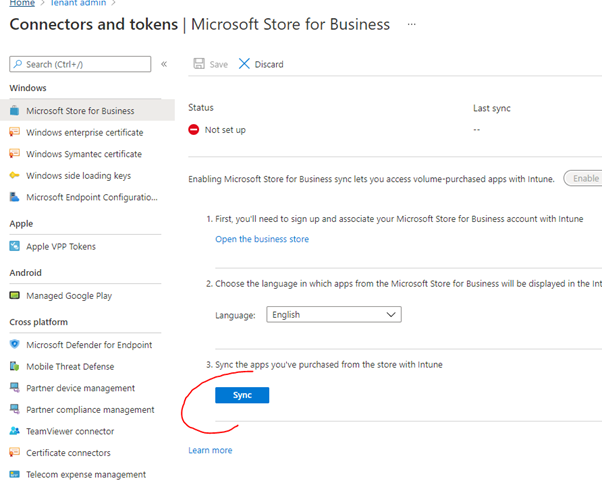

This can take some time to complete (~hours).

# Appendix A - Online vs Offline

As stated at the start of this document, the Azure VPN Client is only available for installation via the Microsoft Store, this constraint manifests itself in the Store GUI in the following way.

Take another app, the Company Portal app for example, notice in the store you can specify both an Online, and an Offline, version of the app. 

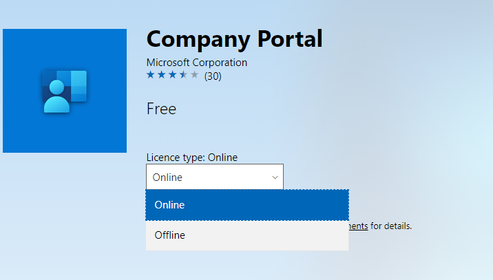

Offline refers to a point in time installation, that will not update unless forced by you, the Intune administrator.

Now look at the Azure VPN Client from the same view.

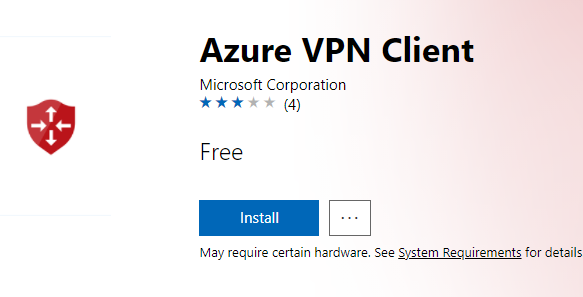

Notice that online vs offline is a toggle that is not available.

That is because the Azure VPN Client app is only an Online app, I.e. it can only be pushed from the store, and must remain insync, I.e. automatically updated.

You can see this reflected in your Manage Apps view in the store.

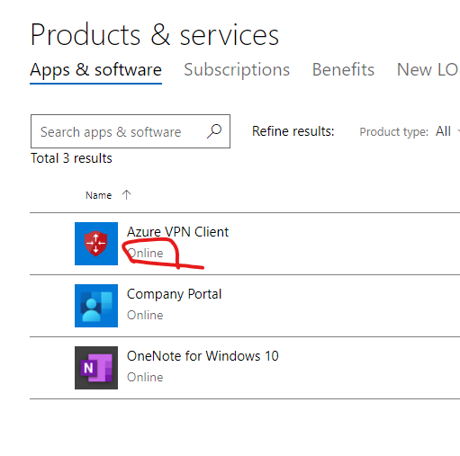

