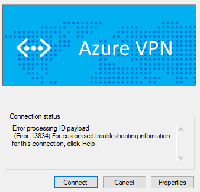
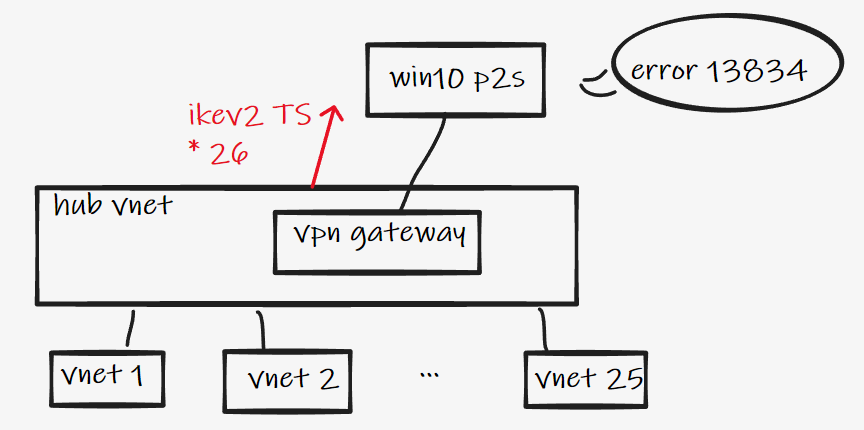
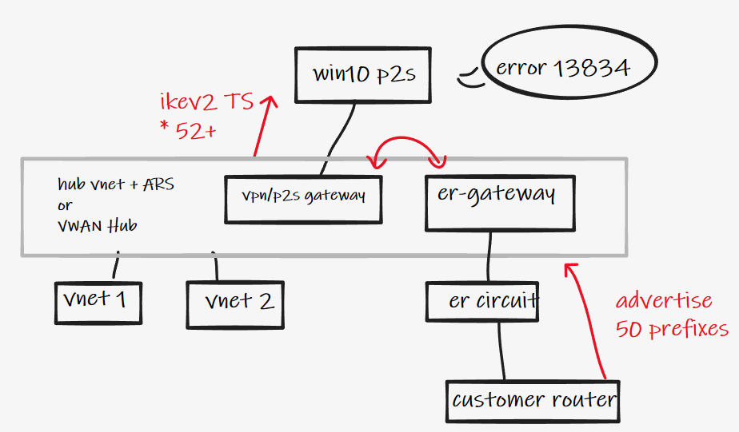
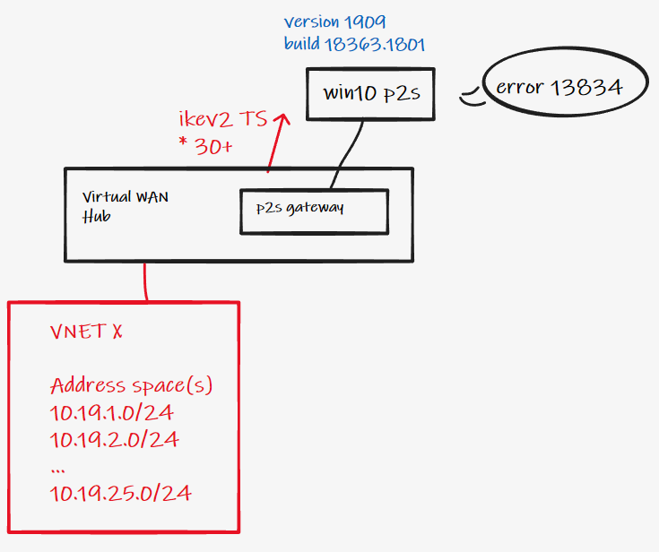
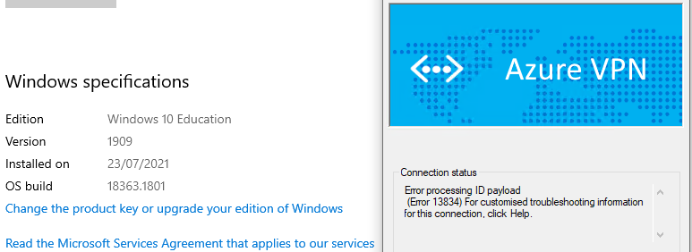
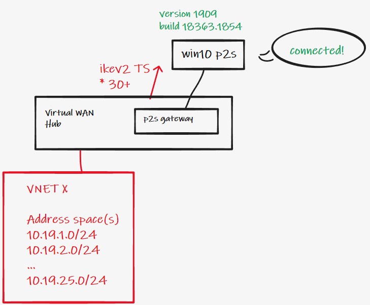
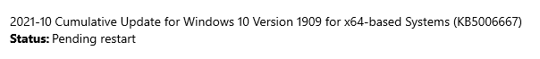
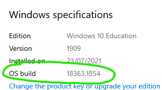

# Windows 10 IKEv2 traffic selectors

<!-- TOC -->

- [Windows 10 IKEv2 traffic selectors](#windows-10-ikev2-traffic-selectors)
- [Short on time?](#short-on-time)
- [Introduction](#introduction)
    - [Context](#context)
    - [Problem Statement](#problem-statement)
    - [Why is the especially problematic for Azure based VPN designs?](#why-is-the-especially-problematic-for-azure-based-vpn-designs)
- [What has changed?](#what-has-changed)
    - [Build updates](#build-updates)
    - [The proof is in the pudding](#the-proof-is-in-the-pudding)
        - [Example old build](#example-old-build)
        - [Example new build](#example-new-build)
    - [Azure P2S gateway debugging](#azure-p2s-gateway-debugging)
- [Protocol limits](#protocol-limits)
- [Protocol limits](#protocol-limits)
- [Closing](#closing)

<!-- /TOC -->

# Short on time?

The Windows 10 IKEv2 TS limit has been raised from 25 after the [builds](#build-updates) listed below.

#  Introduction

## Context

When building remote user / client VPN / P2S VPN solutions on Azure (or indeed using On-Premises VPN servers) a required part of the process is to select the protocol used for tunnel transport. Today this typically results in either OpenVPN or IKEv2, with the former offering many advantages. That said, IKEv2 is still used by some customers, and more importantly still required for some scenarios. One common scenario is the Device Tunnel feature in Windows 10, which must use IKEv2, more context/detail [here](https://github.com/adstuart/azure-vpn-p2s/tree/main/vwan-multihub).

> Please build P2S solutions using OpenVPN where possible, it will make your life a lot easier.

## Problem Statement

Prior to September 2021 Windows 10 exhibited a behaviour with respect to [IKEv2 Phase 2 (aka quick mode) traffic selectors](https://datatracker.ietf.org/doc/html/rfc5996#page-40) that sometimes became problematic for Client VPN designs. Specifically the problem was ("is" depending on your patch level, keep reading... :) ) **if you advertise a total of more than 25 Traffic Selectors then VPN tunnel setup on the client would fail** with the following error:

> Error processing ID payload. (Error 13834)



You may have seen references to this issue elsewhere on the internet:

- https://www.tsls.co.uk/index.php/2019/11/07/azure-gateway-point-site-windows-vpn-client-error-processing-id-payload/ (ignore the build info/versions here, this information is no longer accurate)
- [feedback.azure.com](https://webcache.googleusercontent.com/search?q=cache:7Nn0BHAboDQJ:https://feedback.azure.com/forums/217313-networking/category/345028-virtual-wan%3Fcategory_id%3D77468+&cd=5&hl=en&ct=clnk&gl=uk) (no longer in use)
- https://github.com/MicrosoftDocs/azure-docs/issues/40135

In fact it is even documented on the Azure networking limits [page](https://docs.microsoft.com/en-us/azure/azure-resource-manager/management/azure-subscription-service-limits#:~:text=P2S%20route%20limit,25%20for%20Windows) 


## Why is the especially problematic for Azure based VPN designs?

Consider the following diagram. Azure VPN Gateway will advertise a phase 2 traffic selector per address space (CIDR) block you have configured on a VNet. Therefore it only takes a hub + 25 VNets to advertise more than 25 TS to your P2S Clients. Route summarisation or IKEv2 TS consolidation is not possible using native Azure solutions, today.



Ok, you might say well "no worries, I have less than 25 VNets". Now lets consider an emerging trend that is quite popular with customers. Using an _Azure Hub VNET_ (with Azure Router Server) or _Azure Virtual WAN Hub_ as a transit hub to onwards networks (ExpressRoute, S2S VPN, other regions). 



Every prefix that comes in via ExpressRoute gets reflected as one extra traffic selector. Same for remote BGP connected S2S branches, same for remote region CIDR blocks in VWAN.

**I.e. When building transit designs in Azure, you can very quickly exceed the 25 TS limit, render your IKEv2 client tunnel inoperable, and there are no effective ways to prevent this happening.**

# What has changed?

## Build updates

To quote the KBs:

> Removes the limitation of 25 maximum Traffic Selectors in the Windows native Internet Key Exchange (IKE) client and server.

This has been fixed in the following Windows 10 [builds](https://docs.microsoft.com/en-us/windows/release-health/release-information):

| Version | OS Build | KB Link |
| ------------- | ------------- |   ------------- |
| 1809 aka RS5 | 17763.2210  |   [KB5005625](https://support.microsoft.com/en-us/topic/september-21-2021-kb5005625-os-build-17763-2210-preview-5ae2f63d-a9ce-49dd-a5e6-e05b90dc1cd8#:~:text=Removes%20the%20limitation%20of%2025%20maximum%20Traffic%20Selectors%20in%20the%20Windows%20native%20Internet%20Key%20Exchange%20(IKE)%20client%20and%20server)  |
| 1909 aka 19H2 | 18363.1830  |   [KB5005624](https://support.microsoft.com/en-gb/topic/september-21-2021-kb5005624-os-build-18363-1830-preview-b2a3af81-696b-4d59-8d7b-a05389407bb8#:~:text=Removes%20the%20limitation%20of%2025%20maximum%20Traffic%20Selectors%20in%20the%20Windows%20native%20Internet%20Key%20Exchange%20(IKE)%20client%20and%20server.) |
| 2004 aka 20H1 | 19041.1266, 19042.1266, and 19043.1266  |   [KB5005611](https://support.microsoft.com/en-us/topic/september-30-2021-kb5005611-os-builds-19041-1266-19042-1266-and-19043-1266-preview-a37f5409-f320-4175-9a66-c2682fc11c07#:~:text=Removes%20the%20limitation%20of%2025%20maximum%20Traffic%20Selectors%20in%20the%20Windows%20native%20Internet%20Key%20Exchange%20(IKE)%20client%20and%20server.%C2%A0) |
| 20H2 | 19041.1266, 19042.1266, and 19043.1266 |   [KB5005611](https://support.microsoft.com/en-us/topic/september-30-2021-kb5005611-os-builds-19041-1266-19042-1266-and-19043-1266-preview-a37f5409-f320-4175-9a66-c2682fc11c07#:~:text=Removes%20the%20limitation%20of%2025%20maximum%20Traffic%20Selectors%20in%20the%20Windows%20native%20Internet%20Key%20Exchange%20(IKE)%20client%20and%20server.%C2%A0)|
| 21H1 | 19041.1266, 19042.1266, and 19043.1266 |  [KB5005611](https://support.microsoft.com/en-us/topic/september-30-2021-kb5005611-os-builds-19041-1266-19042-1266-and-19043-1266-preview-a37f5409-f320-4175-9a66-c2682fc11c07#:~:text=Removes%20the%20limitation%20of%2025%20maximum%20Traffic%20Selectors%20in%20the%20Windows%20native%20Internet%20Key%20Exchange%20(IKE)%20client%20and%20server.%C2%A0) |
| 21H2 (preview) | n/a already fixed |   |
| Windows 11 :-)| n/a already fixed |   |

Thanks to Philipp Kuhn for collating the above.

## The proof is in the pudding

### Example old build

I have the following topology. Using multiple address spaces on a single spoke VNet to cause VWAN P2S gateway to advertise >25 IkeV2 TS. (Remember, each address space = new CIDR = new TS).

NB. If you want to do this yourself, the easiest way to add address spaces is using the following AZ CLI command:

```az network vnet update -g resourcegorup -n vnetname --address-prefixes  10.18.0.0/16 10.21.27.0/24 ... ...```





> NB. For completeness, if I remove the spoke VNet peering from the hub (reducing the traffic selectors under 25), the VPN connects fine.

### Example new build

I reconnected my previously provlematic spoke, but also updated by Win10 Client (version 1909) from build 18363.1801 to build 18363.1854. Bingo!





## Azure P2S gateway debugging

FYI, if you want to verify the number of traffic selectors sent from the Azure P2S gateway, you can do this by [enabling IKE logging](https://docs.microsoft.com/en-us/azure/virtual-wan/monitor-virtual-wan#diagnostic-steps) on the gateway. Sending this to a Log Analytics workspace and then querying appropriately. 

Here is an example Log Analytics Kusto query to find what you are looking for quickly:
```
AzureDiagnostics 
| where Category == "IKEDiagnosticLog"
| where Message contains "Number of TS"
```
Which gives example output:
```
SESSION_ID :{8cb5875d-4c80-434b-8702-d78ac5b3d154} Remote 77.98.70.226:59780: Local 51.124.63.204:4500: [SEND] Proposed Traffic Selector payload will be (Final Negotiated) - [Tsid 0xe  ]Number of TSIs 16: StartAddress 0.0.0.0 EndAddress 255.255.255.255 PortStart 0 PortEnd 65535 Protocol 0, StartAddress 0.0.0.0 EndAddress 255.255.255.255 PortStart 0 PortEnd 65535 Protocol 0, StartAddress 0.0.0.0 EndAddress 255.255.255.255 PortStart 0 PortEnd 65535 Protocol 0, StartAddress 0.0.0.0 EndAddress 255.255.255.255 PortStart 0 PortEnd 65535 Protocol 0, StartAddress 0.0.0.0 EndAddress 255.255.255.255 PortStart 0 PortEnd 65535 Protocol 0, StartAddress 0.0.0.0 EndAddress 255.255.255.255 PortStart 0 PortEnd 65535 Protocol 0, StartAddress 0.0.0.0 EndAddress 255.255.255.255 PortStart 0 PortEnd 65535 Protocol 0, StartAddress 0.0.0.0 EndAddress 255.255.255.255 PortStart 0 PortEnd 65535 Protocol 0, StartAddress 0.0.0.0 EndAddress 255.255.255.255 PortStart 0 PortEnd 65535 Protocol 0, StartAddress 0.0.0.0 EndAddress 255.255.255.255 PortStart 0 PortEnd 65535 Protocol 0, StartAddress 0.0.0.0 EndAddress 255.255.255.255 PortStart 0 PortEnd 65535 Protocol 0, StartAddress 0.0.0.0 EndAddress 255.255.255.255 PortStart 0 PortEnd 65535 Protocol 0, StartAddress 0.0.0.0 EndAddress 255.255.255.255 PortStart 0 PortEnd 65535 Protocol 0, StartAddress 0.0.0.0 EndAddress 255.255.255.255 PortStart 0 PortEnd 65535 Protocol 0, StartAddress 0.0.0.0 EndAddress 255.255.255.255 PortStart 0 PortEnd 65535 Protocol 0, StartAddress 0.0.0.0 EndAddress 255.255.255.255 PortStart 0 PortEnd 65535 Protocol 0 Number of TSRs 16:StartAddress 10.14.0.0 EndAddress 10.14.0.255 PortStart 0 PortEnd 65535 Protocol 0, StartAddress 10.15.0.0 EndAddress 10.15.255.255 PortStart 0 PortEnd 65535 Protocol 0, StartAddress 192.168.128.0 EndAddress 192.168.128.255 PortStart 0 PortEnd 65535 Protocol 0, StartAddress 10.5.250.0 EndAddress 10.5.250.255 PortStart 0 PortEnd 65535 Protocol 0, StartAddress 172.20.202.0 EndAddress 172.20.202.127 PortStart 0 PortEnd 65535 Protocol 0, StartAddress 10.18.0.0 EndAddress 10.18.255.255 PortStart 0 PortEnd 65535 Protocol 0, StartAddress 10.31.0.0 EndAddress 10.31.0.255 PortStart 0 PortEnd 65535 Protocol 0, StartAddress 10.3.0.0 EndAddress 10.3.255.255 PortStart 0 PortEnd 65535 Protocol 0, StartAddress 10.2.0.0 EndAddress 10.2.255.255 PortStart 0 PortEnd 65535 Protocol 0, StartAddress 10.6.0.0 EndAddress 10.6.255.255 PortStart 0 PortEnd 65535 Protocol 0, StartAddress 10.0.0.0 EndAddress 10.0.255.255 PortStart 0 PortEnd 65535 Protocol 0, StartAddress 10.10.0.0 EndAddress 10.10.255.255 PortStart 0 PortEnd 65535 Protocol 0, StartAddress 192.168.200.0 EndAddress 192.168.200.255 PortStart 0 PortEnd 65535 Protocol 0, StartAddress 192.168.129.0 EndAddress 192.168.129.255 PortStart 0 PortEnd 65535 Protocol 0, StartAddress 192.168.2.0 EndAddress 192.168.2.255 PortStart 0 PortEnd 65535 Protocol 0, StartAddress 172.20.202.128 EndAddress 172.20.202.255 PortStart 0 PortEnd 65535 Protocol 0
```
# Protocol limits

With the above we have removed the 25 TS limit in Windows, which will unblock lots of customers building Azure based P2S designs. But there is another limit to be aware of:

> IKEv2 as a protocol standard supports a maximum of [255](https://datatracker.ietf.org/doc/html/rfc5996#:~:text=Number%20of%20TSs%20(1%20octet)%20-%20Number%20of%20Traffic%20Selectors%20being%0A%20%20%20%20%20%20provided.) TS.

If you exceed this limit (E.g. you have 1000 ExpressRoute routes being advertised via VWAN or Route Server to P2S, or, you have 255 VNets) then my testing suggests that the P2S tunnel will still establish, but traffic will be intermittent as not all remote prefixes are represented with a working traffic selector.

I.e. For scenarios requiring more tha 255 routes advertised to P2S clients, you should use a design involving either;

- Network virtual appliance + third party TLS based VPN
- Perform summarisation somewhere in the network, e.g. before routers are advertised to Azure via ExpresSRoute
- Use Azure native P2S VPN Gateways in combination with OpenVPN as a protocol instead of IKEv2

# Closing

Thanks to fellow Microsoft colleagues for collaborative discussions that contributed to this article.
  
- Nirmal Thewarathanthri
- Thomas Vuylsteke
- Jack Tracey
- Nikhil Jayakumar
- Philipp Kuhn
- Jason Jones
- Daniel Mauser
- Welly Lee
- Ahmad AlDeiri
- Cristian Critelli
- Windows Dev team

