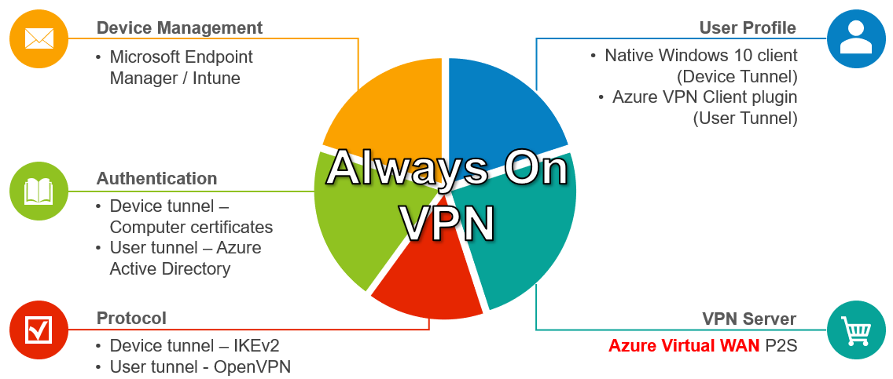
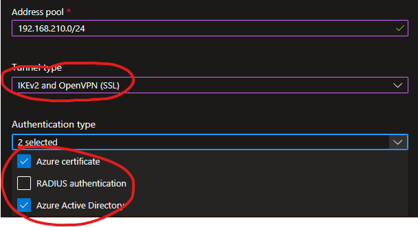
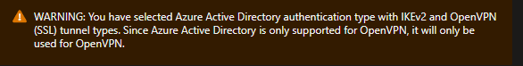
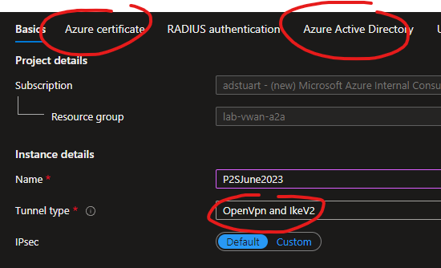
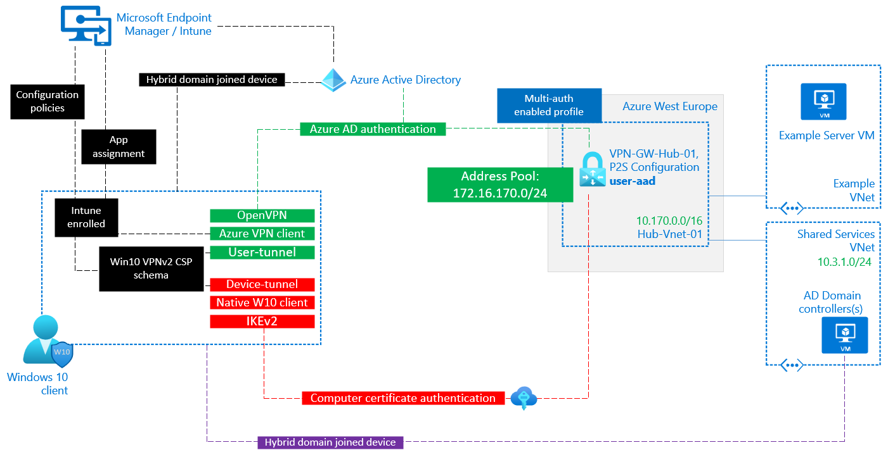
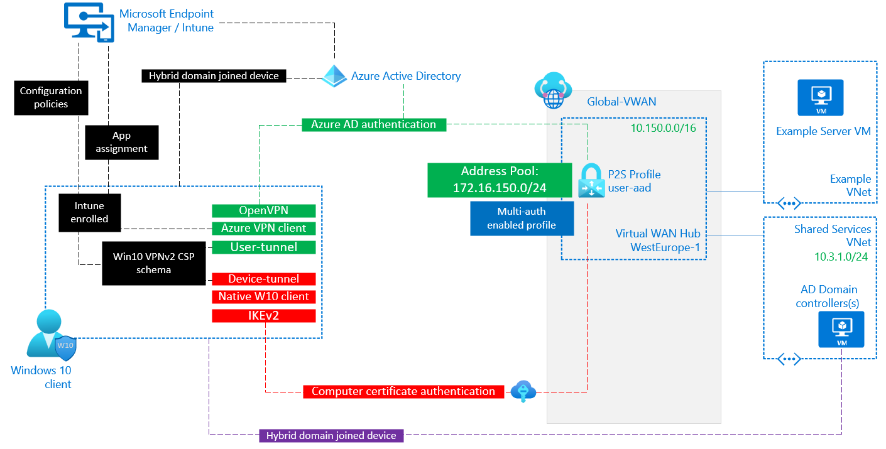

# Migrate from DirectAccess to Always On VPN with Azure (Using P2S Multi-authentication and either VPN Gateway or Virtual WAN)

## Short on time?

This document shows how to use either **Azure Virtual WAN** or **Azure VPN Gateway** to support **Always On VPN** designs for **hybrid domain-joined** scenarios (with a requirement for Device Tunnel), whilst at the same time supporting **Azure Active Directory** for user authentication (User Tunnel).

> Skip the preamble and jump straight to the [technical design](#2-Multi-auth-design-for-AOVPN).

> :bulb: This design uses the newly available (June 2023) multi-authentication feature to support simulatanouly tunnels on the same P2S Gateway, and superseeds the previous "dual hub design" [here](https://github.com/adstuart/azure-vpn-p2s/tree/main/vpngateway-multivnet) and [here](https://github.com/adstuart/azure-vpn-p2s/tree/main/vwan-multihub).

# 1. Introduction

As companies continue to migrate their data and applications to the Cloud, and users are increasingly working remotely, IT organisations look to provide a Client VPN solution that runs on Azure.

Oftentimes an On-Premises solution is comprised of physical network hardware, or may come in the form of software running on X86. A popular example of the latter is Microsoft [DirectAccess](https://docs.microsoft.com/en-us/windows-server/remote/remote-access/directaccess/directaccess), which in part relies on the [RRAS](https://docs.microsoft.com/en-us/windows-server/remote/remote-access/directaccess/single-server-wizard/deploy-a-single-directaccess-server-using-the-getting-started-wizard) role within Windows Server. RRAS is not supported on Windows Servers in Azure, therefore simply lifting-and-shifting  DirectAccess (DA) to Azure is not possible.

## 1.1. Context

This document assumes you have done the due diligence at a higher level before deciding that a Client VPN Solution is required for your organisation. **Many companies have made the journey to modernise their access to applications in the Cloud and may no longer require traditional Client VPNs**. 

One example of this approach is to publish your applications directly to the Public Internet  using an identity based security solution with Multi-factor authentication and conditional access - think [M365](https://www.ncsc.gov.uk/collection/saas-security/product-evaluations/office-365). Another approach would be to publish the application using [Azure AD Application Proxy](https://docs.microsoft.com/en-us/azure/active-directory/app-proxy/application-proxy). Both of these scenarios would negate the requirement for a network-based security solution using IPsec VPNs. That said, in 2023 it is still very much the case that most Enterprise organisations require a Client VPN solution for at least some part of their IT organisation.

## 1.2. Always On VPN

Rather than being a single Microsoft product, just like DirectAccess, Always on VPN represents a framework within which to build your remote access solution. 

For a customer moving their data and applications to Azure, wanting a native end-to-end Microsoft Client VPN solution is desirable, and therefore **[Always On VPN](https://docs.microsoft.com/en-us/windows-server/remote/remote-access/vpn/always-on-vpn/always-on-vpn-technology-overview)** is the most natural alternative for customers looking for a DA replacement. However, as stated previously, RRAS is not supported in Azure. Therefore we need an alternative component in Azure to fulfil the role of **VPN server**, within the Always on VPN (AOVPN) framework.

This document shows how you can leverage Azure Virtual WAN or Azure VPN Gateway to provide this **VPN Server** in the cloud,  and leverage the multi-authentication feature to cater for hybrid-domain joined scenarios. The components used within the AOVPN framework for this article are shown below.

> In an attempt to provide prescriptive guidance, and narrow the range of variables, this article aims for a common scenario; companies wishing to use a combination of User Tunnel and Azure VPN Client to facilitate secure modern authentication via Azure AD. Whilst also utilizing Device Tunnel to allow interoperability with a hybrid-domain joined scenario. More on that below.

## 1.3. Windows 10 VPN 

A (very) quick summary of the Windows 10 VPN platform:

- Built-in VPN Client software. Pre-packaged out of the box, supports IKEv2 and SSTP protocols
- Supports universal VPN plugins, often used to enhance the base feature set E.g. to support SSL based VPNs
  - Azure VPN Client is just one example of a plugin, many other vendors such as Palo Alto exist in this space
   - These plugins require installation beyond what is supplied in the base Win10 O/S
- Configuration via the VPNv2 configuration service provider (CSP) standardised [interface](https://docs.microsoft.com/en-us/windows/client-management/mdm/vpnv2-csp)
  -  This CSP can be configured locally via PowerShell, or remotely via an MDM (E.g., Intune)
  -  Support for ProfileXML files that contain a list of profile settings, in a defined structure that aligns with the parameters set out in the VPNv2 schema

More technical detail [here](https://docs.microsoft.com/en-us/windows/security/identity-protection/vpn/vpn-guide).

## 1.4. User Tunnel vs Device Tunnel

Using the above O/S VPN framework, AOVPN offers two types of tunnels. Understanding which combination of these to use is critical to your AOVPN design, especially when working with Azure-based VPN servers.

- **Device tunnel** runs before a user logs on to the device. Scenarios that require pre-login connectivity include device management and by far the most common;  _the ability to connect to a corporate Active Directory server for user authentication_. Device tunnel **only supports IKEv2** as a transport protocol, and **only supports computer certificates** for authentication. 

- **User tunnel** connects after a user logs on to the device. User tunnel is probably doing the job you expected of a Client VPN Solution - providing secured access to your applications and data in the cloud. User tunnel has much more flexibility for transport and authentication protocols as its able to take advantage of the plugin framework described above.

## 1.5. Identity matters

Your current approach to [user](https://docs.microsoft.com/en-us/azure/active-directory/devices/hybrid-azuread-join-plan) and [device identity](https://docs.microsoft.com/en-us/azure/active-directory/devices/overview) will heavily determine which of these tunnel types you require. Let's focus on the most common scenarios, and understand why this is such an important area.

### 1.5.1. Azure Active Directory

If both your user and [device identities](https://docs.microsoft.com/en-us/azure/active-directory/devices/concept-azure-ad-join) are solely in, and 100% migrated to, Azure AD, then this simplifies your requirements for an AOVPN design. The main reason for this is the lack of need for pre-login connectivity. if a user needs to login to their Windows 10 client laptop, and the machine does not have cached credentials, they are able to attempt authentication over the public Internet, directly to Azure AD. 

:point_right: :point_right: The implication for your AOVPN design is therefore that you only need to provide a solution based on _User Tunnel_.

### 1.5.2. Hybrid domain joined

If you are however, like many organisations, still on the journey to Cloud and workings towards a modern identity strategy, then you may still be leveraging traditional Active Directory for user control, policy enforcement and/or device management. The most typical scenario being some form of IaaS based domain controllers in Azure, replicating back to an On-Premises locations, with [exchange of identity data](https://docs.microsoft.com/en-us/azure/active-directory/hybrid/whatis-azure-ad-connect/) between the AD domain and Azure AD. 

It is in these scenarios that the use of Device Tunnel becomes much more important. This is because pre-login tasks such as a user attempting authentication without any cached credentials **require access to a server within your corporate network**, these same servers are not reachable over the public Internet. 

This is the gap that Device Tunnel fills, running before user logon, using the device computer certificate for authentication. Whilst its possible to _only_ use Device Tunnel, the recommended and secure approach is to compliment this pre-login access with User Tunnel for post login corp access. I.e.:

- Device Tunnel should only grant access to a subset of your infrastructure, typically only your domain controllers and/or config management servers.

- User Tunnel (which can be based on a much more secure posture of user based identity) is then used post login to access the wider corporate application estate

:point_right: :point_right: The implication for your AOVPN design is therefore that you need to provide a solution that serves both _User Tunnel_ **and** _Device Tunnel_.

## 1.6. Bringing it all together

The reason I've taken then time to explore the above in a good level of detail is to introduce the reason why the new Multi-authentication feature can unlock support for hybrid-domain scenarios in Azure.

**_Why is this?_**

When we design for the VPN Server role in Azure, we have two options. _Azure Virtual WAN_ or _Azure VPN Gateway_. Today, both of these components are now able to support simultaneously authentication types when using multiple transport protocols. 

> Previously the use of Multi-authentication types was constrained to Gateways running a single transport protocol, often OpenVPN only

|  |
|:--:|
| <b>Multi-auth portal dialogue with VPN-Gateway showing simultaenous use of muti-auth and multi-protocol</b>|

|  |
|:--:|
| <b>Reminder that OpenVPN Protocol is required for AAD auth</b>|

|  |
|:--:|
| <b>Multi-auth portal dialogue with Virtual WAN showing simultaenous use of muti-auth and multi-protocol</b>|

**_So... ?_**

If you are designing a P2S solution for an environment that is hybrid-domain joined, you need both User Tunnel and Device Tunnel. If your User Tunnel and Device Tunnel use different transport protocol (IKEv2 for DT, OpenVPN for UT), as is common if wanting to leverage AAD for User Tunnel, this can now be done using a single gateway.  

# 2. Multi-auth design for AOVPN

## 2.1. VPN Gateway

> See deprecated guide for more detailed Gateway/client config - [click](https://github.com/adstuart/azure-vpn-p2s/tree/main/vpngateway-multivnet)

## 2.1. Virtual WAN

> See deprecated guide for more detailed Gateway/client config - [click](https://github.com/adstuart/azure-vpn-p2s/tree/main/vwan-multihub)

