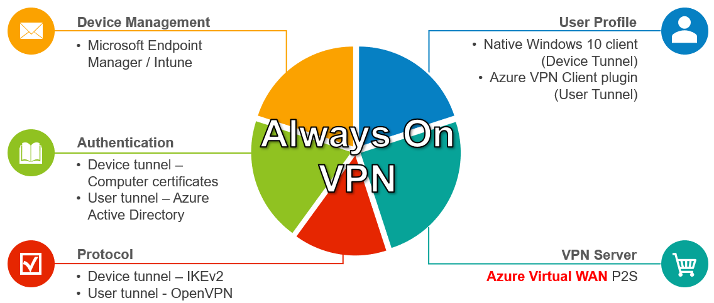
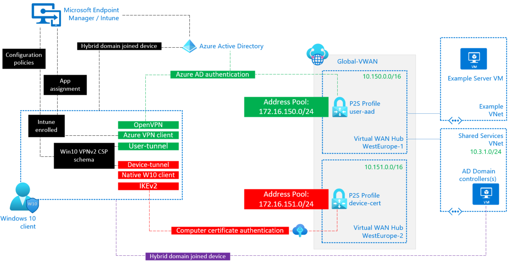
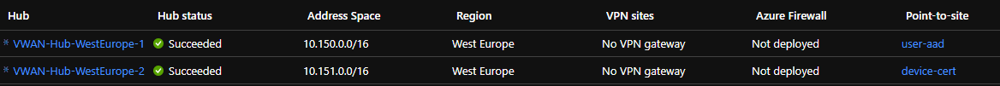
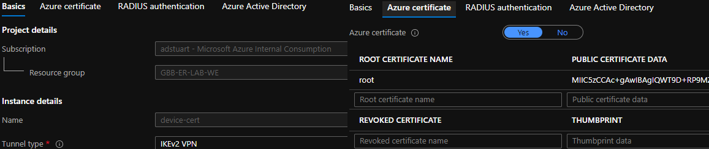
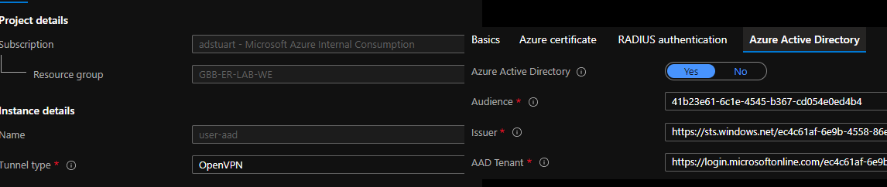
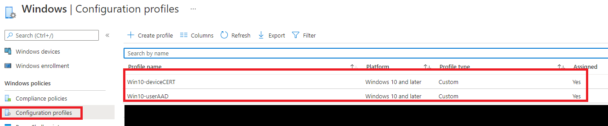
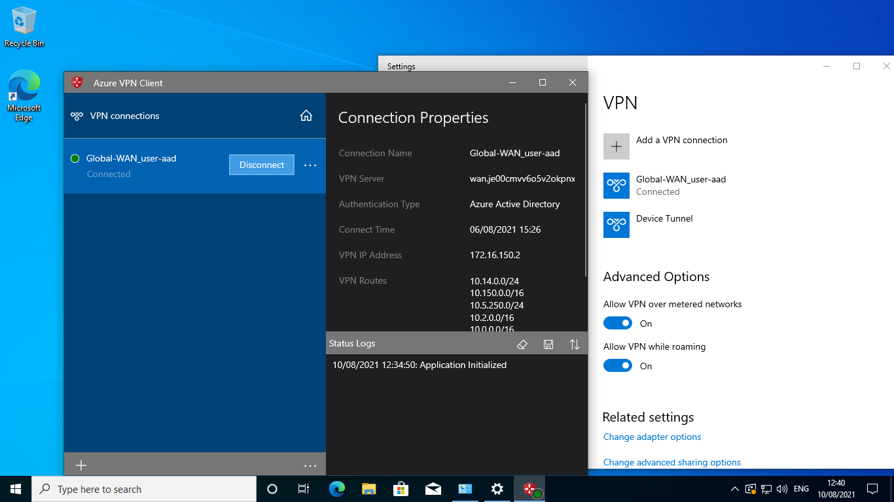
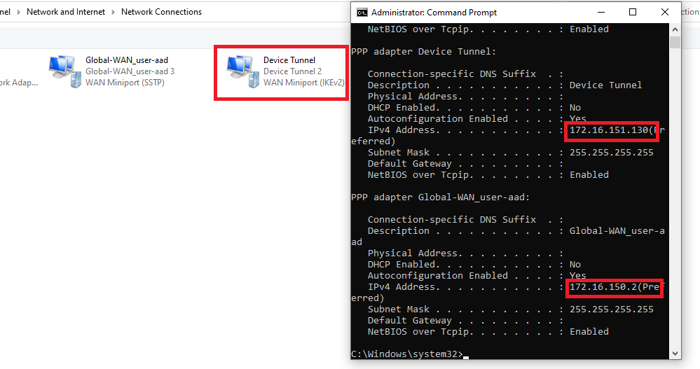
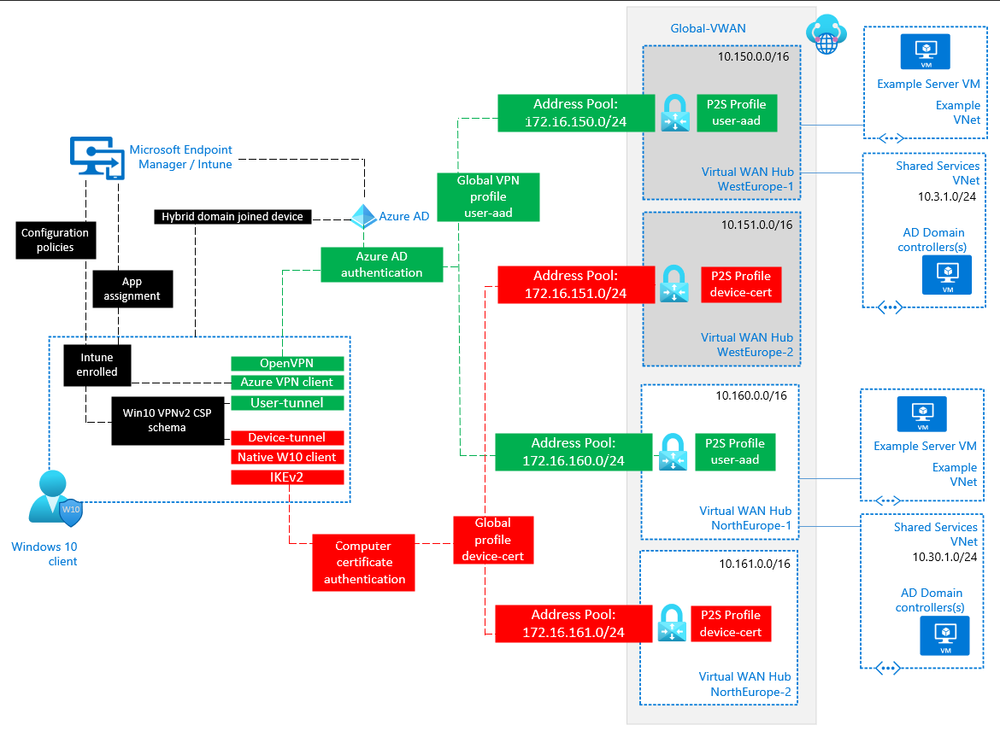
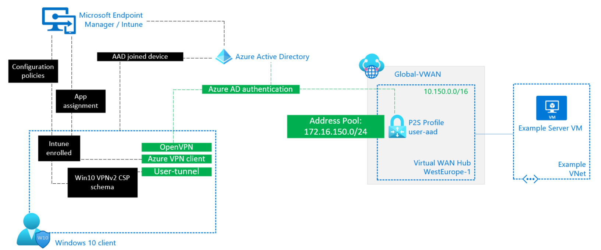

# Migrate from DirectAccess to Always On VPN with Azure Virtual WAN

<!-- TOC -->

- [Migrate from DirectAccess to Always On VPN with Azure Virtual WAN](#migrate-from-directaccess-to-always-on-vpn-with-azure-virtual-wan)
    - [Short on time?](#short-on-time)
- [1. Introduction](#1-introduction)
    - [1.1. Context](#11-context)
    - [1.2. Always On VPN](#12-always-on-vpn)
    - [1.3. Windows 10 VPN](#13-windows-10-vpn)
    - [1.4. User Tunnel vs Device Tunnel](#14-user-tunnel-vs-device-tunnel)
    - [1.5. Identity matters](#15-identity-matters)
        - [1.5.1. Azure Active Directory](#151-azure-active-directory)
        - [1.5.2. Hybrid domain joined](#152-hybrid-domain-joined)
    - [1.6. Bringing it all together](#16-bringing-it-all-together)
- [2. Virtual WAN Multi-hub design for AOVPN](#2-virtual-wan-multi-hub-design-for-aovpn)
    - [2.1. Deploy Virtual WAN hubs and Point-to-site configuration](#21-deploy-virtual-wan-hubs-and-point-to-site-configuration)
    - [2.2. Client configuration](#22-client-configuration)
        - [2.2.1. Profile XML template for user tunnel](#221-profile-xml-template-for-user-tunnel)
        - [2.2.2. Profile XML template for device tunnel](#222-profile-xml-template-for-device-tunnel)
    - [2.3. Network Security](#23-network-security)
    - [2.4. Add regional resilience](#24-add-regional-resilience)
    - [2.5. Additional Technical considerations](#25-additional-technical-considerations)
    - [2.6. Good to know](#26-good-to-know)
- [3. Appendix](#3-appendix)
    - [User-tunnel only](#user-tunnel-only)

<!-- /TOC -->

## Short on time?

Skip the preamble and jump straight to the [technical design](#2-virtual-wan-multi-hub-design-for-aovpn).

# 1. Introduction

As companies continue to migrate their data and applications to the Cloud, and users are increasingly working remotely, IT organisations look to provide a Client VPN solution that runs on Azure.

Oftentimes an On-Premises solution is comprised of physical network hardware, or may come in the form of software running on X86. A popular example of the latter is Microsoft [DirectAccess](https://docs.microsoft.com/en-us/windows-server/remote/remote-access/directaccess/directaccess), which in part relies on the [RRAS](https://docs.microsoft.com/en-us/windows-server/remote/remote-access/directaccess/single-server-wizard/deploy-a-single-directaccess-server-using-the-getting-started-wizard) role within Windows Server. RRAS is not supported on Windows Servers in Azure, therefore simply lifting-and-shifting  DirectAccess (DA) to Azure is not possible, therefore customers look for alternate solutions such as **Azure Virtual WAN**.

## 1.1. Context

This document assumes you have done the due diligence at a higher level before deciding that a Client VPN Solution is required for your organisation. **Many companies have made the journey to modernise their access to applications in the Cloud and may no longer require traditional Client VPNs**. 

One example of this approach is to publish your applications directly to the Public Internet  using an identity based security solution with Multi-factor auth and condition access - think [M365](https://www.ncsc.gov.uk/collection/saas-security/product-evaluations/office-365). Another approach would be to publish the application using [Azure AD Application Proxy](https://docs.microsoft.com/en-us/azure/active-directory/app-proxy/application-proxy). Both of these scenarios would negate the requirement for a network-based security solution using IPsec VPNs. That said, in 2021 it is still very much the case that most Enterprise organisations require a Client VPN solution for at least some part of their IT organisation.

## 1.2. Always On VPN

Rather than being a single Microsoft product, just like DirectAccess, Always on VPN represents a framework within which to build your remote access solution. 

For a customer moving their data and applications to Azure, wanting a native end-to-end Microsoft Client VPN solution is desirable, and therefore **[Always On VPN](https://docs.microsoft.com/en-us/windows-server/remote/remote-access/vpn/always-on-vpn/always-on-vpn-technology-overview)** is the most natural alternative for customers looking for a DA replacement. However, as stated previously, RRAS is not supported in Azure. Therefore we need an alternative component in Azure to fulfil the role of **VPN server**, within the Always on VPN (AOVPN) framework.

This document shows how you can leverage [Azure Virtual WAN](https://docs.microsoft.com/en-us/azure/virtual-wan/virtual-wan-about) to provide this **VPN Server** in the cloud,  and leverage a multi-hub architecture to cater for hybrid-domain joined scenarios. The components used within the AOVPN framework for this article are shown below.



> In an attempt to provide prescriptive guidance, and narrow the range of variables, this article aims for a common scenario; companies wishing to use a combination of User Tunnel and Azure VPN Client to facilitate secure modern authentication via Azure AD. Whilst also utilizing Device Tunnel to allow interoperability with a hybrid-domain joined scenario. More on that below.

## 1.3. Windows 10 VPN 

A (very) quick summary of the Windows 10 VPN platform:

- Built-in VPN Client software. Pre-packaged out of the box, supports IKEv2 and SSTP protocols
- Supports universal VPN plugins, often used to enhance the base feature set E.g. to support SSL based VPNs
  - Azure VPN Client is just one example of a plugin, many other vendors such as Palo Alto exist in this space
   - These plugins require installation beyond what is supplied in the base Win10 O/S
- Configuration via the VPNv2 configuration service provider (CSP) standardised [interface](https://docs.microsoft.com/en-us/windows/client-management/mdm/vpnv2-csp)
  -  This CSP can be configured locally via PowerShell, or remotely via an MDM (E.g., Intune)
  -  Support for ProfileXML files that contain a list of profile settings, in a defined structure that aligns with the parameters set out in the VPNv2 schema

More technical detail [here](https://docs.microsoft.com/en-us/windows/security/identity-protection/vpn/vpn-guide).


## 1.4. User Tunnel vs Device Tunnel

Using the above O/S VPN framework, AOVPN offers two types of tunnels. Understanding which combination of these to use is critical to your AOVPN design, especially when working with Azure-based VPN servers.

- **Device tunnel** runs before a user logs on to the device. Scenarios that require pre-login connectivity include device management and by far the most common;  _the ability to connect to a corporate Active Directory server for user authentication_. Device tunnel **only supports IKEv2** as a transport protocol, and **only supports computer certificates** for authentication. 

- **User tunnel** connects after a user logs on to the device. User tunnel is probably doing the job you expected of a Client VPN Solution - providing secured access to your applications and data in the cloud. User tunnel has much more flexibility for transport and authentication protocols as its able to take advantage of the plugin framework described above.

## 1.5. Identity matters

Your current approach to [user](https://docs.microsoft.com/en-us/azure/active-directory/devices/hybrid-azuread-join-plan) and [device identity](https://docs.microsoft.com/en-us/azure/active-directory/devices/overview) will heavily determine which of these tunnel types you require. Let's focus on the most common scenarios, and understand why this is such an important area.

### 1.5.1. Azure Active Directory

If both your user and [device identities](https://docs.microsoft.com/en-us/azure/active-directory/devices/concept-azure-ad-join) are solely in. and 100% migrated to, Azure AD, then this simplifies your requirements for an AOVPN design. The main reason for this is the lack of need for pre-login connectivity. if a user needs to login to their Windows 10 client laptop, and the machine does not have cached, they are able to attempt authentication over the public Internet, directly to Azure AD. 

:point_right: :point_right: The implication for your AOVPN design is therefore that you only need to provide a solution based on _User Tunnel_.

### 1.5.2. Hybrid domain joined

If you are however, like many organisations, still on the journey to Cloud and workings towards a modern identity strategy, then you may still be leveraging traditional Active Directory for user control, policy enforcement and/or device management. The most typical scenario being some form of IaaS based domain controllers in Azure, replicating back to an On-Premises locations, with some sort of [exchange of identity data](https://docs.microsoft.com/en-us/azure/architecture/reference-architectures/identity/) between the AD domain and Azure AD. 

It is in these scenarios that the use of Device Tunnel becomes much more important. This is because pre-login tasks such as a user attempting authentication without any cached credentials **require access to a server within your corporate network**, these same servers are not reachable over the public Internet. 

This is the gap that Device Tunnel fills, running before user logon, using the device computer certificate for authentication. Whilst its possible to _only_ use Device Tunnel, the recommended and secure approach is to compliment this pre-login access with User Tunnel for post login corp access. I.e.:

- DT should only grant access to a subset of your infrastructure, typically only your domain controllers and/or config management servers.

- UT (which can be based on a much more secure posture of user based identity) is then used post login to access the wider corporate application estate

:point_right: :point_right: The implication for your AOVPN design is therefore that you only need to provide a solution that serves both _User Tunnel_ **and** _Device Tunnel_.

## 1.6. Bringing it all together

The reason I've taken then time to explore the above in a good level of detail is to introduce the reason why an Azure Virtual WAN multi-hub design can unlock support for hybrid-domain scenarios in Azure.

_Why is this?_

When we design for the VPN Server role in Azure, we have two options. _Azure Virtual WAN_ or _Azure VPN Gateway_. Today, both of these components are unable to support simultaneously authentication types when using multiple transport protocols.

_So... ?_

If you are designing a P2S solution for an environment that is hybrid-domain joined, you need both UT and DT. If your UT and DT use different transport protocol, as is common if wanting to leverage AAD for UT, this cannot be done using a single gateway. Therefore you need multiple Azure VPN head-ends to achieve this. However, anyone that has spent some time with Azure Networking will know that almost all of Azure Networking is centralised around hub/spoke models wherein a _single gateway is used_. 

_So what?_

**Azure Virtual WAN** now allows the use of Multiple Hubs in the same Azure region. **Each hub can support its own P2S Gateway. Each P2S gateway supports a unique P2S profile. These P2S profiles can contain your require parameters for a) User tunnel and b) Device Tunnel.**

# 2. Virtual WAN Multi-hub design for AOVPN



## 2.1. Deploy Virtual WAN hubs and Point-to-site configuration

Use the official Azure documentation [here](https://docs.microsoft.com/en-us/azure/virtual-wan/virtual-wan-point-to-site-portal) as a starter for 10. If done correctly, you end up with two Virtual WAN Hubs in the same region, within a common Virtual WAN. 

This guide is not intended to be step-by-step implementation instructions, more focused on the high level architecture. You will find the follow articles useful if you are not already familiar with Azure Virtual WAN and P2S configuration in Azure.

- [Configure Azure Active Directory authentication for User VPN](https://docs.microsoft.com/en-us/azure/virtual-wan/virtual-wan-point-to-site-azure-ad)
- [Create custom Intune profiles to deploy User VPN client profiles](]https://docs.microsoft.com/en-us/azure/virtual-wan/vpn-profile-intune)
- [Configure an Always On VPN device tunnel for Virtual WAN](https://docs.microsoft.com/en-us/azure/virtual-wan/howto-always-on-device-tunnel)
- [Always On VPN Device Tunnel Configuration using Intune](https://directaccess.richardhicks.com/2019/03/25/always-on-vpn-device-tunnel-configuration-using-intune/)
- [Install client certificates for P2S certificate authentication connections](https://docs.microsoft.com/en-us/azure/vpn-gateway/point-to-site-how-to-vpn-client-install-azure-cert)

How things should look:

|  | 
|:--:| 
| <span style="font-size:0.8em;">Two Virtual WAN Hubs, note separate User VPN configurations</span> |

|  | 
|:--:| 
| <span style="font-size:0.8em;">Device Tunnel P2S configuration</span> |


|  | 
|:--:| 
| <span style="font-size:0.8em;">User Tunnel P2S configuration</span> |

## 2.2. Client configuration

A few assumptions have been made to keep this article focused on Azure Virtual WAN, as opposed to Client side instructions:
- Your clients are all running Windows 10.
- They are hybrid domain joined.
- You are using _Intune_ for device management. This would also work fine with _Configuration manager_, or even pushing out parameters locally.
- You have a working [PKI infrastructure](https://docs.microsoft.com/en-us/mem/intune/protect/certificates-profile-scep) and have deployed the required certificates to your machines.
- You have the Azure VPN Client installed on all clients at scale, this is typically pushed out [via Intune](https://github.com/adstuart/azure-vpn-p2s/tree/main/intune-azurevpnclient) app profiles. 

How things should look:

|  | 
|:--:| 
| <span style="font-size:0.8em;">Intune device configuration profiles, one for user tunnel, one for device tunnel, both assigned to your required group for VPN users</span> |

|  | 
|:--:| 
| <span style="font-size:0.8em;">Verification of **User tunnel** function. Successfully authenticated via AAD. </span> |

|  | 
|:--:| 
| <span style="font-size:0.8em;">Verification of **Device tunnel** function. Successfully authenticated via certificates.  </span> |

> In the above screenshots, notice how my user tunnel has been allocated an IP address within the 172.16.150.0/24 subnet allocated to my User-tunnel VPN configuration profile in Virtual WAN. Also notice how my device tunnel has been allocated an IP address within the 172.16.151.0/24 subnet allocated to my Device-tunnel VPN configuration profile in Virtual WAN. 

Verificaiton is also possible from the Virtual WAN headend, you can check individual connection status via the CLI, some info [here](https://github.com/adstuart/azure-vpn-p2s/tree/main/misc-cheatsheet).


### 2.2.1. Profile XML template for user tunnel

```xml
 <VPNProfile>
   <!--<EdpModeId>corp.contoso.com</EdpModeId>-->
   <RememberCredentials>true</RememberCredentials>
   <AlwaysOn>true</AlwaysOn>
   <TrustedNetworkDetection>contoso.com,test.corp.contoso.com</TrustedNetworkDetection>
   <DeviceTunnel>false</DeviceTunnel>
   <RegisterDNS>false</RegisterDNS>
   <PluginProfile>
     <ServerUrlList>**Your VWAN FQDN**</ServerUrlList> 
     <CustomConfiguration>

<AzVpnProfile xmlns:i="http://www.w3.org/2001/XMLSchema-instance" xmlns="http://schemas.datacontract.org/2004/07/">
  <any xmlns:d2p1="http://schemas.datacontract.org/2004/07/System.Xml"
    i:nil="true" />
  <clientauth>
    <aad>
      <audience>41b23e61-6c1e-4545-b367-xxxxxxx</audience>
      <cachesigninuser>true</cachesigninuser>
      <issuer>https://sts.windows.net/ec4c61af-6e9b-4558-86e3-xxxxxx/</issuer>
      <tenant>https://login.microsoftonline.com/ec4c61af-6e9b-4558-86e3-xxxxxx</tenant>
    </aad>
    <cert
      i:nil="true" />
    <type>aad</type>
    <usernamepass
      i:nil="true" />
  </clientauth>
  <clientconfig
    i:nil="true" />
  <name>Global-WAN_user-aad</name>
  <protocolconfig>
    <sslprotocolConfig>
      <transportprotocol>tcp</transportprotocol>
    </sslprotocolConfig>
  </protocolconfig>
  <serverlist>
    <ServerEntry>
      <displayname
        i:nil="true" />
      <fqdn>**Your VWAN FQDN**</fqdn>
    </ServerEntry>
  </serverlist>
  <servervalidation>
    <cert>
      <hash>**snip**</hash>
      <issuer
        i:nil="true" />
    </cert>
    <serversecret>**snip**</serversecret>
    <type>cert</type>
  </servervalidation>
  <version>1</version>
</AzVpnProfile>

     </CustomConfiguration>
     <PluginPackageFamilyName>Microsoft.AzureVpn_8wekyb3d8bbwe</PluginPackageFamilyName>
   </PluginProfile>
 </VPNProfile>
 ```


### 2.2.2. Profile XML template for device tunnel

```xml
<VPNProfile>  
  <NativeProfile>  
<Servers>**Your VWAN FQDN**</Servers>  
<NativeProtocolType>IKEv2</NativeProtocolType>  
<Authentication>  
  <MachineMethod>Certificate</MachineMethod>  
</Authentication>  
<RoutingPolicyType>SplitTunnel</RoutingPolicyType>  
 <!-- disable the addition of a class based route for the assigned IP address on the VPN interface -->
<DisableClassBasedDefaultRoute>true</DisableClassBasedDefaultRoute>  
  </NativeProfile> 
  <!-- IP address prefixes, typically of your domain controllers -->  
  <Route>  
<Address>10.3.1.4</Address>  
<PrefixSize>32</PrefixSize>  
  </Route>  
   <Route>  
<Address>10.3.1.5</Address>  
<PrefixSize>32</PrefixSize>  
  </Route>  
<!-- need to specify always on = true --> 
  <AlwaysOn>true</AlwaysOn> 
<!-- new node to specify that this is a device tunnel -->  
 <DeviceTunnel>true</DeviceTunnel>
<!--new node to register client IP address in DNS to enable manage out -->
<RegisterDNS>true</RegisterDNS>
</VPNProfile>
```

## 2.3. Network Security

As stated earlier in this article, it is important to consider the scope of access permitted by both your device-tunnel. As this runs pre-login, you want to restrict this to the minimum level of access required, for example only your domain controllers if you are using DT for pre-login auth via Active Directory.

There are multiple ways to achieve this network restriction.
- In the above Profile XML, you will notice the `<Route></Route>` field used for definition of specific IPs. These are reflected in local O/S routes on Windows pointing traffic at the VPN tunnel. E.g. Routes plumbed for my example Device tunnel based on the above Profile XML.
```
C:\Windows\system32>route print | findstr 172.16.151.130
         10.3.1.4  255.255.255.255         On-link    172.16.151.130     26
         10.3.1.5  255.255.255.255         On-link    172.16.151.130     26
   <snip>
```
- Relying on routing alone is _security through obscurity_, the underlying tunnel is capable of encrypting traffic for IP prefixes outside of these static routes (_All VWAN CIDR rages are advertised as part of IkeV2 phase 2 setup and traffic selector negotiation_), if the user happens to know your corporate subnet ranges, and has the RBAC to create local static routes, they could in theory pass traffic. See [here](https://docs.microsoft.com/en-us/windows-server/remote/remote-access/vpn/vpn-device-tunnel-config#vpn-device-tunnel-configuration) how the same XML file can used to implement traffic selectors to restrict this tunnel at the O/S level. Ensure to pay attention to the caveats associated with Traffic Filters.
```
<TrafficFilter>
<RemoteAddressRanges>10.3.1.4, 10.3.1.5</RemoteAddressRanges>
  </TrafficFilter>
```
- You can also leverage your normal security controls, such as Network Security Groups (NSGs), on the Azure side to restrict access "_at destination_". Please note, as this is a design based on multiple Virtual WAN Hubs, pay attention to current platform considerations relating to use of Azure Firewall across multiple [Secured Virtual Hubs](https://docs.microsoft.com/en-us/azure/firewall-manager/overview#known-issues).

## 2.4. Add regional resilience

Taking this design one step further, if you are utilizing a multi-region VWAN deployment, you are able to combine the features of _Regional Multi-hub_ and _[Global P2S profiles](https://docs.microsoft.com/en-us/azure/virtual-wan/global-hub-profile)_, to provide an enhanced design which caters for failure of an entire Azure Region.



## 2.5. Additional Technical considerations

- Device tunnel requires Windows 10 Enterprise or Education version 1709 or later. 
- Device tunnel requires the Windows 10 client to be domain-joined to _Active Directory_ .
- Pay attention to route/prefix limits on the Client side, these will differ based on the transport protocol you are using:
  - IKEv2 as a protocol supports a maximum of 255 Traffic Selectors.
  - IKEv2 on Windows 10 currently has a limitation restriction this value further to [25 Traffic Selectors](https://feedback.azure.com/forums/217313-networking/suggestions/39999847-azure-virtual-wan-p2s-with-windows-native-vpn-clie).
  - When working with Azure VPN Server solutions; VPN Gateway or Virtual WAN, ensure you understand how many routes will be advertised. Virtual WAN is transitive in nature, and will advertise prefixes representing all Virtual Hubs and remote networks.
  - OpenVPN with Azure VPN Servers has been tested up to 1000 prefixes. Azure VPN Client is an example of a plugin that enables transport protocol based on OpenVPN protocol.
  - Official Azure Networking limits documentation is [here](https://docs.microsoft.com/en-us/azure/azure-resource-manager/management/azure-subscription-service-limits#virtual-network-gateway-limits).
- If using a plugin such as Azure VPN Client, consider how you will automate the deployment of this at scale, to ensure the best user experience. More detail [here](https://github.com/adstuart/azure-vpn-p2s/tree/main/intune-azurevpnclient).
- Consider commercial elements of using a PaaS solution for VPN Server in the cloud; these solutions can be extremely cost effective due to their Pay-per-hour cost model. This can work for you, or against you. See [here](https://github.com/adstuart/azure-vpn-p2s/tree/main/intune-win10-triggers) for more discussion in this area.

## 2.6. Good to know

- Although outside the scope of this Windows-focused article. If you happen to have Mac clients in your infrastructure, you are now able to leverage the [Azure VPN client for macOS](https://azure.microsoft.com/en-us/updates/general-availability-ga-of-azure-vpn-client-for-macos/), bringing Azure AD auth to VPN on OSX.

# 3. Appendix

## User-tunnel only

For reference, as stated earlier:

> If both your user and [device identities](https://docs.microsoft.com/en-us/azure/active-directory/devices/concept-azure-ad-join) are solely and 100% migrated to the Cloud, then this simplifies your requirements for an AOVPN design. The main reason for this is the lack of need for pre-login connectivity. if a user needs to login to their Windows 10 client laptop, and the machine does not have cached, they are able to attempt authentication over the public Internet, directly to Azure AD. 

> :point_right: The implication for your AOVPN design is therefore that you only need to provide a solution based on _User Tunnel_.

For completeness, here would be the simplified design to accommodate a user-tunnel only requirement.



<!-- -/## IKEv2 only

If you do not wish to make use of AzureAD authentication for User Tunnel, and are happy using IKEv2 for both UT and DT, then a single gateway design can accommodate this requirement. 
- UT with IKEv2, native Win10 client, radius auth 
- DT with IkEv2, native Win10 client, cert auth 
- [This](https://docs.microsoft.com/en-us/azure/active-directory/authentication/howto-mfaserver-dir-radius) document may help if this approach is of interest.

>
